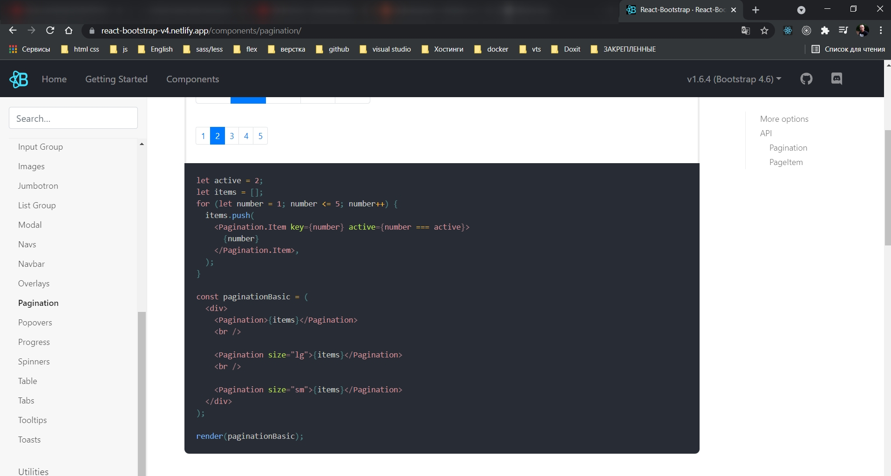
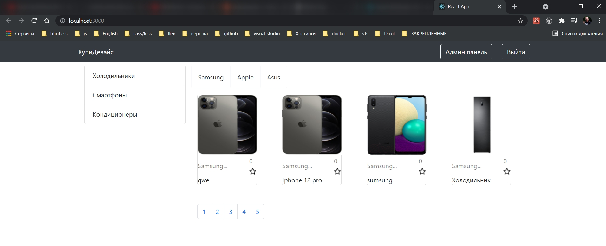
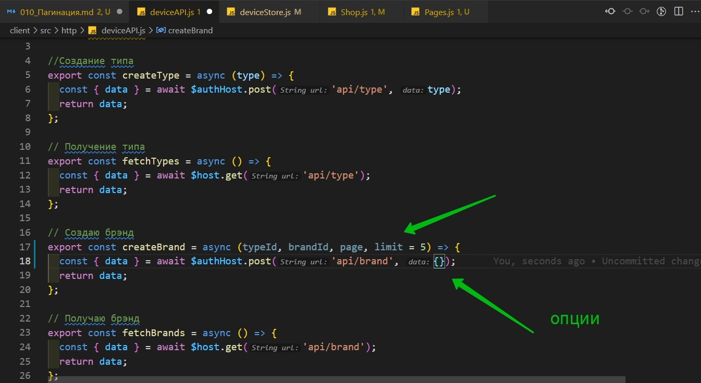
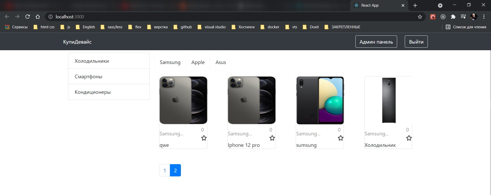
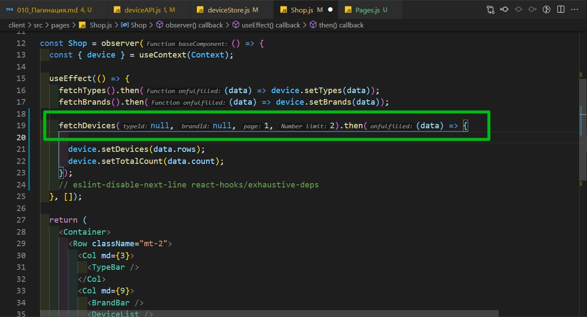
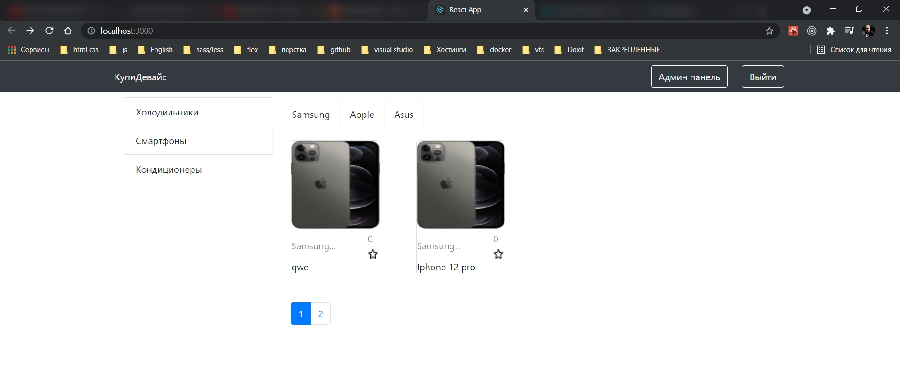
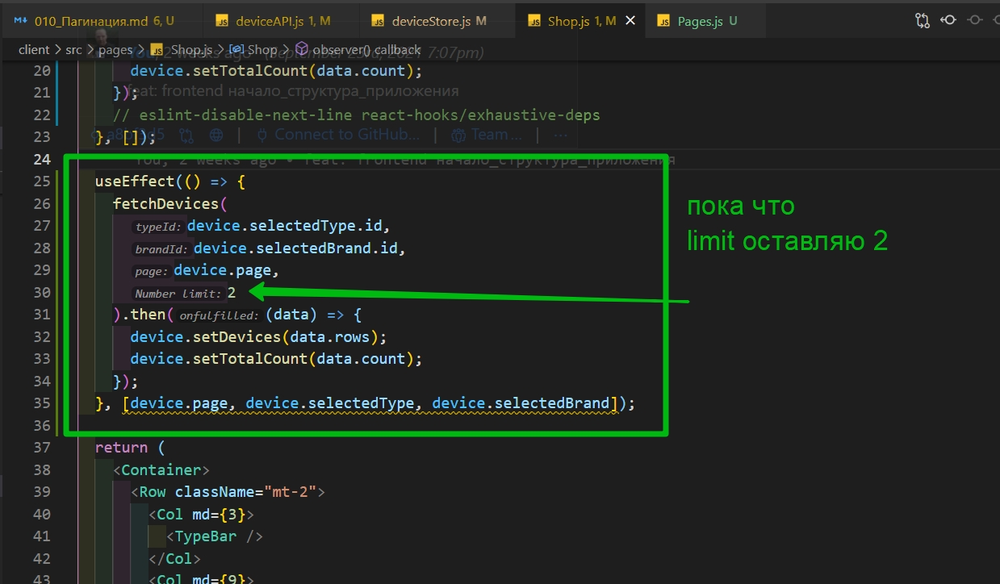
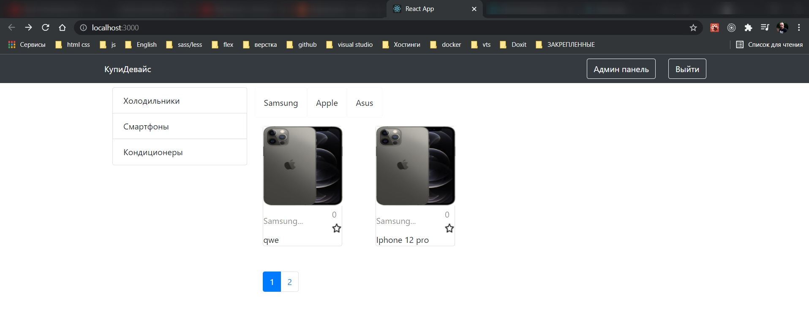
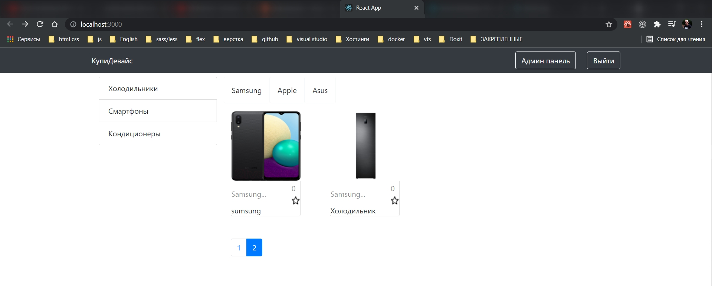
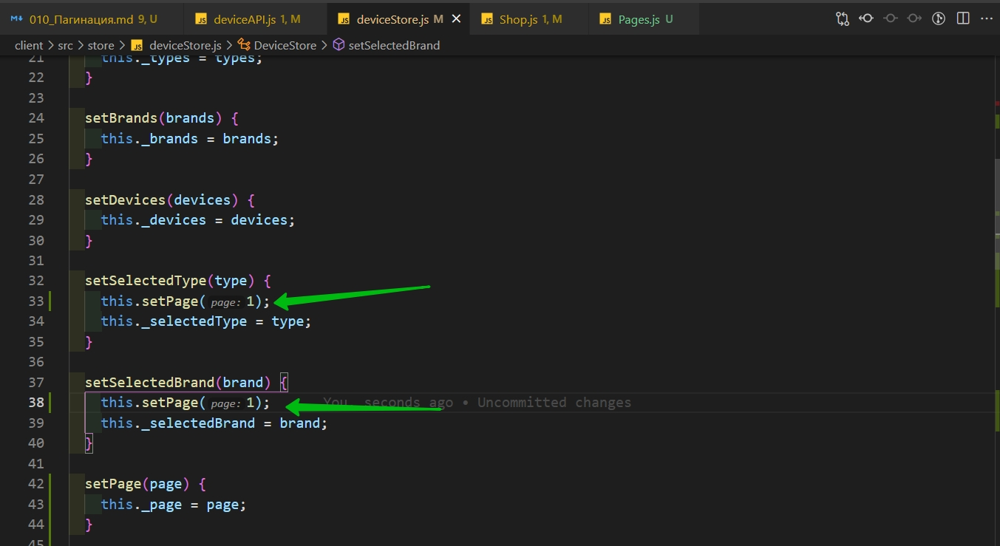

# Пагинация

Нужно сделать постраничную погинацию. А так же при выборе конкретного типа или конкретного бренда мы должны делать фильтрацию и отображать только товары соответствующие данным кретериям.

Начну с пагинации. Открываю **react-bootstrap.github.io**



Создаю новый компонент **Pages.js**

```js
import React from 'react';
import { observer } from 'mobx-react-lite';

const Pages = observer(() => {
  return <div></div>;
});

export default Pages;
```

С помощью хука **useContext** получаем хранилище **device**

```js
import React, { useContext } from 'react';
import { observer } from 'mobx-react-lite';
import { Context } from '../index';

const Pages = observer(() => {
  const { device } = useContext(Context);
  return <div></div>;
});

export default Pages;
```

Затем отрисуем сами странички. Пока что создадим массив заглушку.

```js
import React, { useContext } from 'react';
import { observer } from 'mobx-react-lite';
import { Context } from '../index';
import { Pagination } from 'react-bootstrap';

const Pages = observer(() => {
  const { device } = useContext(Context);
  const pages = [1, 2, 3, 4, 5];

  return (
    <Pagination className="mt-5">
      {pages.map((page) => (
        <Pagination.Item>{page}</Pagination.Item>
      ))}
    </Pagination>
  );
});

export default Pages;
```

Перехожу на страницу **Shop.js** и подключаю.

```js
//pages Shop.js
import React, { useContext, useEffect } from 'react';
import { Container, Row, Col } from 'react-bootstrap';
import TypeBar from '../components/TypeBar';
import BrandBar from '../components/BrandBar';
import DeviceList from '../components/DeviceList';
import { observer } from 'mobx-react-lite';
import { Context } from '../index';
import { fetchBrands, fetchDevices, fetchTypes } from '../http/deviceAPI';
import Pages from '../components/Pages';

const Shop = observer(() => {
  const { device } = useContext(Context);

  useEffect(() => {
    fetchTypes().then((data) => device.setTypes(data));
    fetchBrands().then((data) => device.setBrands(data));
    fetchDevices().then((data) => device.setDevices(data.rows));
  }, []);

  return (
    <Container>
      <Row className="mt-2">
        <Col md={3}>
          <TypeBar />
        </Col>
        <Col md={9}>
          <BrandBar />
          <DeviceList />
          <Pages />
        </Col>
      </Row>
    </Container>
  );
});

export default Shop;
```



Затем переходим в **deviceStore.js** и добавим еще пару новых полей. Во-первых это поле которое отвечает за текущую страницу **this.\_page = 1**. **this.\_totalCount = 0** будет отвечать за общее количество товаров которые доступны по данному запросу. И **limit = 3** это количество товаров на одной странице.

И так же как обычно для кождого поля задаю сеттеры и геттеры **setPage**, **setTotalCount**

```js
// store deviceStore.js

import { makeAutoObservable } from 'mobx';

export default class DeviceStore {
  constructor() {
    this._types = [];
    this._brands = [];
    this._devices = [];
    this._selectedType = {};
    this._selectedBrand = {};
    this._page = 1; // текущая страница
    this._totalCount = 0; // Общее количество товаров
    this._limit = 3; // количество товаров на одной странице

    makeAutoObservable(this);
  }

  // изменяю
  setTypes(types) {
    this._types = types;
  }

  setBrands(brands) {
    this._brands = brands;
  }

  setDevices(devices) {
    this._devices = devices;
  }

  setSelectedType(type) {
    this._selectedType = type;
  }

  setSelectedBrand(brand) {
    this._selectedBrand = brand;
  }

  setPage(page) {
    this._page = page;
  }

  setTotalCount(totalCount) {
    this._totalCount = totalCount;
  }

  setLimit(limit) {
    this._limit = limit;
  }

  // получаю данные
  get types() {
    return this._types;
  }

  get brands() {
    return this._brands;
  }

  get devices() {
    return this._brands;
  }
  get selectedType() {
    return this._selectedType;
  }
  get selectedBrand() {
    return this._selectedBrand;
  }
  get totalCount() {
    return this._totalCount;
  }
  get page() {
    return this._page;
  }
  get limit() {
    return this._limit;
  }
}
```

Затем откроем **deviceAPI.js**. И в функции в которой мы получаем устройства **fetchDevices** параметром будем передавать **typeId**, **brandId**, **page**, **limit**.

- **typeId** - **id** типа товара
- **brandId** - **id** бренда товара
- **page** - номер страницы
- **limit** - количество товара и лимит по умолчанию сделаю равным 5 например.



Затем в опциях мы можем все эти параметры указать. **params: { typeId, brandId, page, limit,}** они автоматически подставятся в строку запроса если переменная не пустая.

```js
import { $host, $authHost } from './index.js';
import jwt_decode from 'jwt-decode';

//Создание типа
export const createType = async (type) => {
  const { data } = await $authHost.post('api/type', type);
  return data;
};

// Получение типа
export const fetchTypes = async () => {
  const { data } = await $host.get('api/type');
  return data;
};

// Создаю брэнд
export const createBrand = async (brand) => {
  const { data } = await $authHost.post('api/brand', brand);
  return data;
};

// Получаю брэнд
export const fetchBrands = async () => {
  const { data } = await $host.get('api/brand');
  return data;
};

//Создаю device
export const createDevice = async (device) => {
  const { data } = await $authHost.post('api/device', device);
  return data;
};

// получаю девайса
export const fetchDevices = async (typeId, brandId, page, limit = 5) => {
  const { data } = await $host.get('api/device', {
    params: {
      typeId,
      brandId,
      page,
      limit,
    }, //они автоматически подставятся в строку запроса если переменная не пустая
  });
  return data;
};

// получаю один девайс
export const fetchOneDevice = async (id) => {
  const { data } = await $host.get('api/device/' + id);
  return data;
};
```

**typeId** и **brandId** передаются для того что бы получить товары конкретно по заданному типу и бренду. Т.е. мы нажали например на холодильники и у нас подгрузились холодильники.

А тем временем я перехожу на страницу **Shop.js**. И после первого получения товара нам надо узнать сколько товаров мы получили, для того что бы мы могли подсчитать общее количество страниц. **device.setTotalCount(data.count);**

Общее количество товаров находится в поле **cout** ответа от сервера.

```js
//pages Shop.js
import React, { useContext, useEffect } from 'react';
import { Container, Row, Col } from 'react-bootstrap';
import TypeBar from '../components/TypeBar';
import BrandBar from '../components/BrandBar';
import DeviceList from '../components/DeviceList';
import { observer } from 'mobx-react-lite';
import { Context } from '../index';
import { fetchBrands, fetchDevices, fetchTypes } from '../http/deviceAPI';
import Pages from '../components/Pages';

const Shop = observer(() => {
  const { device } = useContext(Context);

  useEffect(() => {
    fetchTypes().then((data) => device.setTypes(data));
    fetchBrands().then((data) => device.setBrands(data));
    fetchDevices().then((data) => {
      device.setDevices(data.rows);
      device.setTotalCount(data.count);
    });
    // eslint-disable-next-line react-hooks/exhaustive-deps
  }, []);

  return (
    <Container>
      <Row className="mt-2">
        <Col md={3}>
          <TypeBar />
        </Col>
        <Col md={9}>
          <BrandBar />
          <DeviceList />
          <Pages />
        </Col>
      </Row>
    </Container>
  );
});

export default Shop;
```

В **Pages.js** массив страниц заглушку убираю.

И считаю общее количество страниц. Мы делим общее количество товаров на количество товаров на одной странице. При это числ которое получилось с помощью функции **ceil** округляем в большую сторону.

Потом мы пробегаемся в цикле и в пустой массив **pages** добавляем текущий счетчик в цикле **i + 1**. Т.е. это будет номер страницы.

```js
import React, { useContext } from 'react';
import { observer } from 'mobx-react-lite';
import { Context } from '../index';
import { Pagination } from 'react-bootstrap';

const Pages = observer(() => {
  const { device } = useContext(Context);
  const pageCount = Math.ceil(device.totalCount / device.limit); // делю все количество товаров на колиество товаров отображаемых на одной странице
  const pages = [];

  // далее в цикле перебираю полученный массив. он может быть такой [5,5,5,5,5,5,5]
  // т.е. в каждом индексе содержится количество товаров на странице
  // в цикле на каждый индекс создаю страницу
  for (let i = 0; i < pageCount; i++) {
    pages.push(i + 1);
  }

  return (
    <Pagination className="mt-5">
      {pages.map((page) => (
        <Pagination.Item>{page}</Pagination.Item>
      ))}
    </Pagination>
  );
});

export default Pages;
```

Затем нам нужно как-то выделить текущую страницу. В **Pagination.Item** добавляю **key={page}**, по ключу страница будет отображаться, а так же пропс **active={}** в котором прописываю условие. Если страница которая у нас находится в **device.page ===** странице текущей **page** то тогда она будет активной.

Так же добавляю слушатель события нажатия **onClick**. Т.е. при нажатии мы эту активную страницу будем выделять. **()=> device.setPage(page)**. По дефолту эта страница равна 1.

```js
import React, { useContext } from 'react';
import { observer } from 'mobx-react-lite';
import { Context } from '../index';
import { Pagination } from 'react-bootstrap';

const Pages = observer(() => {
  const { device } = useContext(Context);
  const pageCount = Math.ceil(device.totalCount / device.limit); // делю все количество товаров на колиество товаров отображаемых на одной странице
  const pages = [];

  // далее в цикле перебираю полученный массив. он может быть такой [5,5,5,5,5,5,5]
  // т.е. в каждом индексе содержится количество товаров на странице
  // в цикле на каждый индекс создаю страницу
  for (let i = 0; i < pageCount; i++) {
    pages.push(i + 1);
  }

  return (
    <Pagination className="mt-5">
      {pages.map((page) => (
        <Pagination.Item
          key={page}
          active={device.page === page}
          onClick={() => device.setPage(page)}
        >
          {page}
        </Pagination.Item>
      ))}
    </Pagination>
  );
});

export default Pages;
```



Как видим при нажатии у нас меняется активная.

теперь остается решить вопрос с подгрузкой конкретных устройств.

Переходим на страницу **Shop.js**

И так пока писал оказыватся в **deviceAPI** описанные ранее параметры нужно передавать не в **fetchBrands** а в **fetchDevice**

```js
import { $host, $authHost } from './index.js';
import jwt_decode from 'jwt-decode';

//Создание типа
export const createType = async (type) => {
  const { data } = await $authHost.post('api/type', type);
  return data;
};

// Получение типа
export const fetchTypes = async () => {
  const { data } = await $host.get('api/type');
  return data;
};

// Создаю брэнд
export const createBrand = async (brand) => {
  const { data } = await $authHost.post('api/brand', brand);
  return data;
};

// Получаю брэнд
export const fetchBrands = async () => {
  const { data } = await $host.get('api/brand');
  return data;
};

//Создаю device
export const createDevice = async (device) => {
  const { data } = await $authHost.post('api/device', device);
  return data;
};

// получаю девайса
export const fetchDevices = async (typeId, brandId, page, limit = 5) => {
  const { data } = await $host.get('api/device', {
    params: {
      typeId,
      brandId,
      page,
      limit,
    },
  });
  return data;
};

// получаю один девайс
export const fetchOneDevice = async (id) => {
  const { data } = await $host.get('api/device/' + id);
  return data;
};
```

Теперь перехожу на страницу **Shop.js** и здесь в функцию **fetchDevices()** мы параметрами пока что **typeId**, **brandId** передадим по **null**, текущая страница 1, и оганичение по количеству товаров 2.



```js
//pages Shop.js
import React, { useContext, useEffect } from 'react';
import { Container, Row, Col } from 'react-bootstrap';
import TypeBar from '../components/TypeBar';
import BrandBar from '../components/BrandBar';
import DeviceList from '../components/DeviceList';
import { observer } from 'mobx-react-lite';
import { Context } from '../index';
import { fetchBrands, fetchDevices, fetchTypes } from '../http/deviceAPI';
import Pages from '../components/Pages';

const Shop = observer(() => {
  const { device } = useContext(Context);

  useEffect(() => {
    fetchTypes().then((data) => device.setTypes(data));
    fetchBrands().then((data) => device.setBrands(data));
    fetchDevices(null, null, 1, 2).then((data) => {
      device.setDevices(data.rows);
      device.setTotalCount(data.count);
    });
    // eslint-disable-next-line react-hooks/exhaustive-deps
  }, []);

  return (
    <Container>
      <Row className="mt-2">
        <Col md={3}>
          <TypeBar />
        </Col>
        <Col md={9}>
          <BrandBar />
          <DeviceList />
          <Pages />
        </Col>
      </Row>
    </Container>
  );
});

export default Shop;
```



Теперь при нажатии на страницу нам надо эту страницу менять. В **Shop.js** воспользуемся **useEffect**, который вторым параметром принимает массив зависимостей. И если в этот массив зависимостей передать напримет **device.page**, то функция которая идет первым параметром в **useEffect** будет вызываться каждый раз когда страница была изменена.



```js
//pages Shop.js
import React, { useContext, useEffect } from 'react';
import { Container, Row, Col } from 'react-bootstrap';
import TypeBar from '../components/TypeBar';
import BrandBar from '../components/BrandBar';
import DeviceList from '../components/DeviceList';
import { observer } from 'mobx-react-lite';
import { Context } from '../index';
import { fetchBrands, fetchDevices, fetchTypes } from '../http/deviceAPI';
import Pages from '../components/Pages';

const Shop = observer(() => {
  const { device } = useContext(Context);

  useEffect(() => {
    fetchTypes().then((data) => device.setTypes(data));
    fetchBrands().then((data) => device.setBrands(data));
    fetchDevices(null, null, 1, 2).then((data) => {
      device.setDevices(data.rows);
      device.setTotalCount(data.count);
    });
    // eslint-disable-next-line react-hooks/exhaustive-deps
  }, []);

  useEffect(() => {
    fetchDevices(
      device.selectedType.id,
      device.selectedBrand.id,
      device.page,
      2
    ).then((data) => {
      device.setDevices(data.rows);
      device.setTotalCount(data.count);
    });
  }, [device.page, device.selectedType, device.selectedBrand]);

  return (
    <Container>
      <Row className="mt-2">
        <Col md={3}>
          <TypeBar />
        </Col>
        <Col md={9}>
          <BrandBar />
          <DeviceList />
          <Pages />
        </Col>
      </Row>
    </Container>
  );
});

export default Shop;
```





Еще сделаем так что бы при смете типа или бренда у нас траница становилас первой.

перехожу в **DeviceStore.js** и в соответствующих **actions** делаю **this.setPage(1)**



```js
// store deviceStore.js

import { makeAutoObservable } from 'mobx';

export default class DeviceStore {
  constructor() {
    this._types = [];
    this._brands = [];
    this._devices = [];
    this._selectedType = {};
    this._selectedBrand = {};
    this._page = 1; // текущая страница
    this._totalCount = 0; // Общее количество товаров
    this._limit = 3; // количество товаров на одной странице

    makeAutoObservable(this);
  }

  // изменяю
  setTypes(types) {
    this._types = types;
  }

  setBrands(brands) {
    this._brands = brands;
  }

  setDevices(devices) {
    this._devices = devices;
  }

  setSelectedType(type) {
    this.setPage(1);
    this._selectedType = type;
  }

  setSelectedBrand(brand) {
    this.setPage(1);
    this._selectedBrand = brand;
  }

  setPage(page) {
    this._page = page;
  }

  setTotalCount(totalCount) {
    this._totalCount = totalCount;
  }

  setLimit(limit) {
    this._limit = limit;
  }

  // получаю данные
  get types() {
    return this._types;
  }

  get brands() {
    return this._brands;
  }

  get devices() {
    return this._brands;
  }
  get selectedType() {
    return this._selectedType;
  }
  get selectedBrand() {
    return this._selectedBrand;
  }
  get totalCount() {
    return this._totalCount;
  }
  get page() {
    return this._page;
  }
  get limit() {
    return this._limit;
  }
}
```
