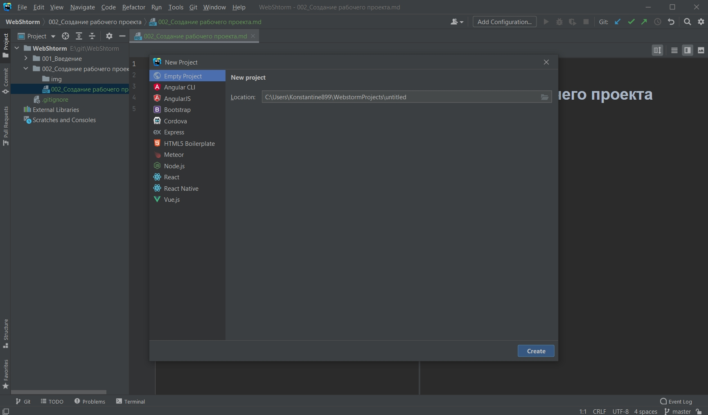
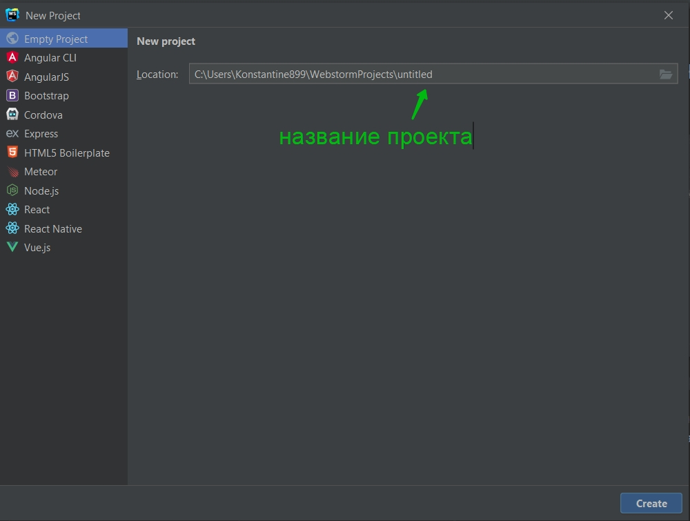
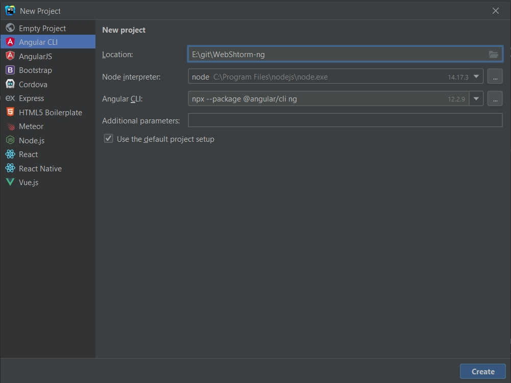

# Создание рабочего проекта

File - New - Project

Тут у нас есть несколько опций. Во-первых мы можем создать пустой проект Empty project. И в первую очередь нам необходимо будет его какт-то назвать.

Однако мы можем уже выбирать какой-то проект из шаблона.

Разберем на примере Angular.

Разберу на примере проекта Angular. Указываю директорию в которой будет новый проект. Так же я могу указать интерпретатор с которым хочу работать Node. Так же подсвечивается его версия.
Angular CLI команда для создания Angular проекта последней версии.
