# Настройки

Во-первых здесь есть различные вкладки которые помогают оперировать.

Поговорим про визуальные настройки данного редактора.

Для этого нажимаю Ctrl + Alt + S.

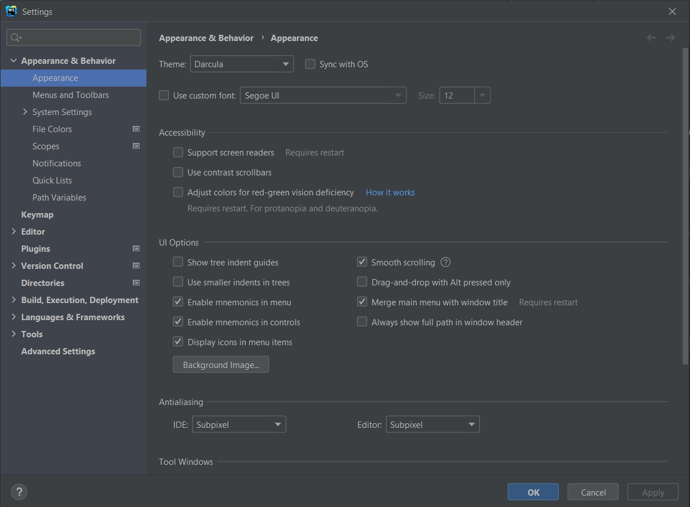

и я попадаю в Preferences. Вообще в WebStorm огромное количество возможностей которые ускоряют процесс вашей разработки.
И вы можете на сайте перейти в меню [С чего начать](https://www.jetbrains.com/ru-ru/webstorm/learn/)

И как видим тут есть

- [Приступая к работе](https://www.jetbrains.com/help/webstorm/getting-started-with-webstorm.html)

- [Полезные советы](https://www.jetbrains.com/webstorm/guide/)

- [Сочетания клавиш](https://www.jetbrains.com/help/webstorm/mastering-keyboard-shortcuts.html)

- [Технологии](https://www.jetbrains.com/help/webstorm/application-gevelopment-guidelines.html)

- [Плагины WebShtorm](https://blog.jetbrains.com/webstorm/2020/05/plugins-for-webstorm-you-need-to-know-about/?_ga=2.226877726.2064070664.1633580876-1828069371.1631724991&_gl=1*13zumeh*_ga*MTgyODA2OTM3MS4xNjMxNzI0OTkx*_ga_V0XZL7QHEB*MTYzMzU4NDgwNi41LjEuMTYzMzU4NzMzNi4w)

- [Учавствуйте в WebShtorm EAP](https://blog.jetbrains.com/webstorm/2020/09/webstorm-eap/?_ga=2.161489215.2064070664.1633580876-1828069371.1631724991&_gl=1*bhajd4*_ga*MTgyODA2OTM3MS4xNjMxNzI0OTkx*_ga_V0XZL7QHEB*MTYzMzU4NDgwNi41LjEuMTYzMzU4NzMzNi4w)

- [Инструменты для работы с БД и SQL](https://blog.jetbrains.com/webstorm/2020/09/support-for-database-tools-and-sql-inside-webstorm/?_ga=2.161489215.2064070664.1633580876-1828069371.1631724991&_gl=1*bhajd4*_ga*MTgyODA2OTM3MS4xNjMxNzI0OTkx*_ga_V0XZL7QHEB*MTYzMzU4NDgwNi41LjEuMTYzMzU4NzMzNi4w)

Зайдем в сочетания клавиш. И как видим тут целаю документация.

Возвращаюсь в Preferences в Appearance & Behavior в поле Appearance мы можем выбирать внешний вид нашего редактора.

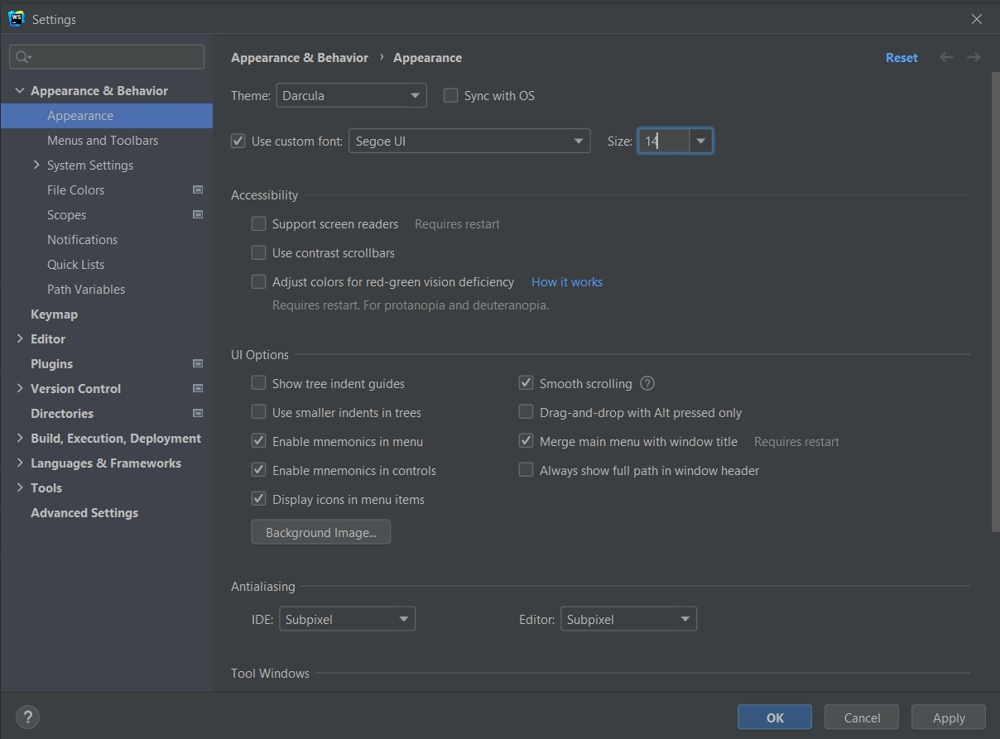

Здесь много чего класного есть для кастомизации.

 
 
 

В поле Keymap мы настраиваем горячие клавиши для редактора.

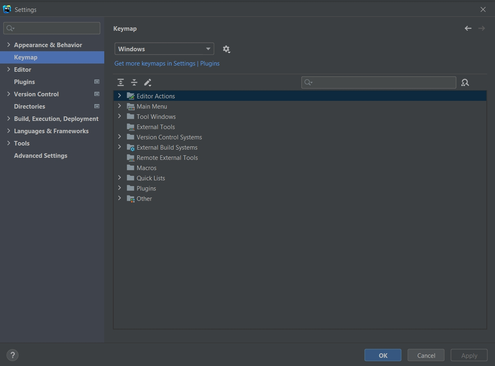

 
 
 

В поле Editor есть много полезных элементов. Посмотрим например Code Style

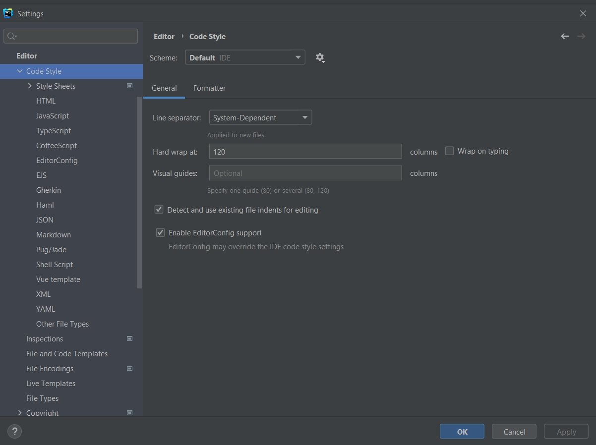

Мы можем выбирать тот язык на котором мы пишем. Это все относится к frontend. И мы можем настраивать редактор под свой стиль кода.

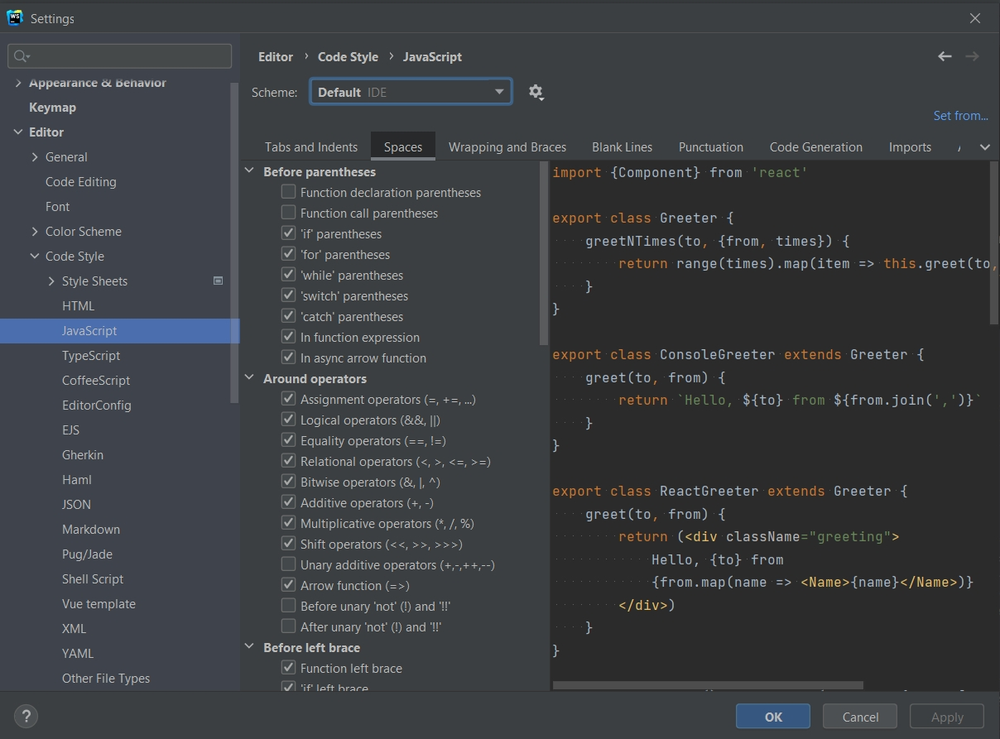

Точно так же мы можем настраивать для TypeScript и для прочих языков.

Что касается inspection

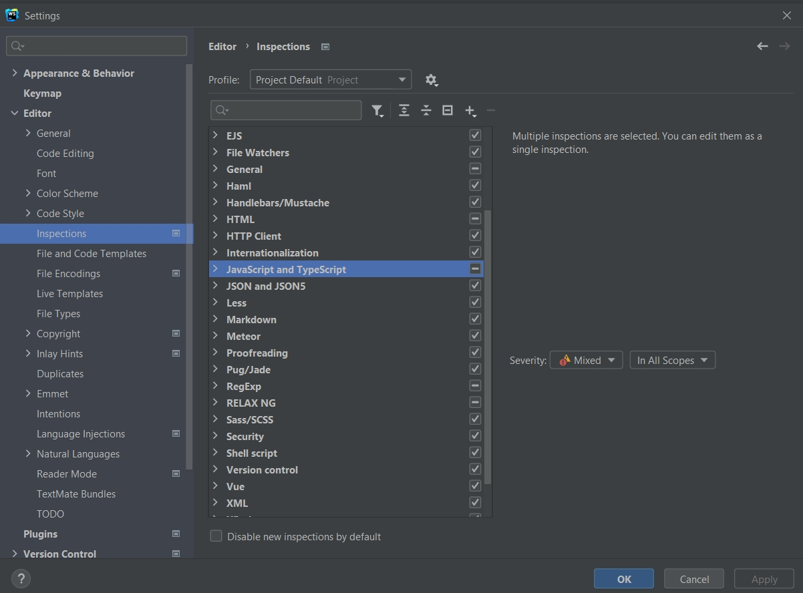

то про них мы поговорим чуть позже.

 
 
 

Так же у нас тут присутствуют Plugins.

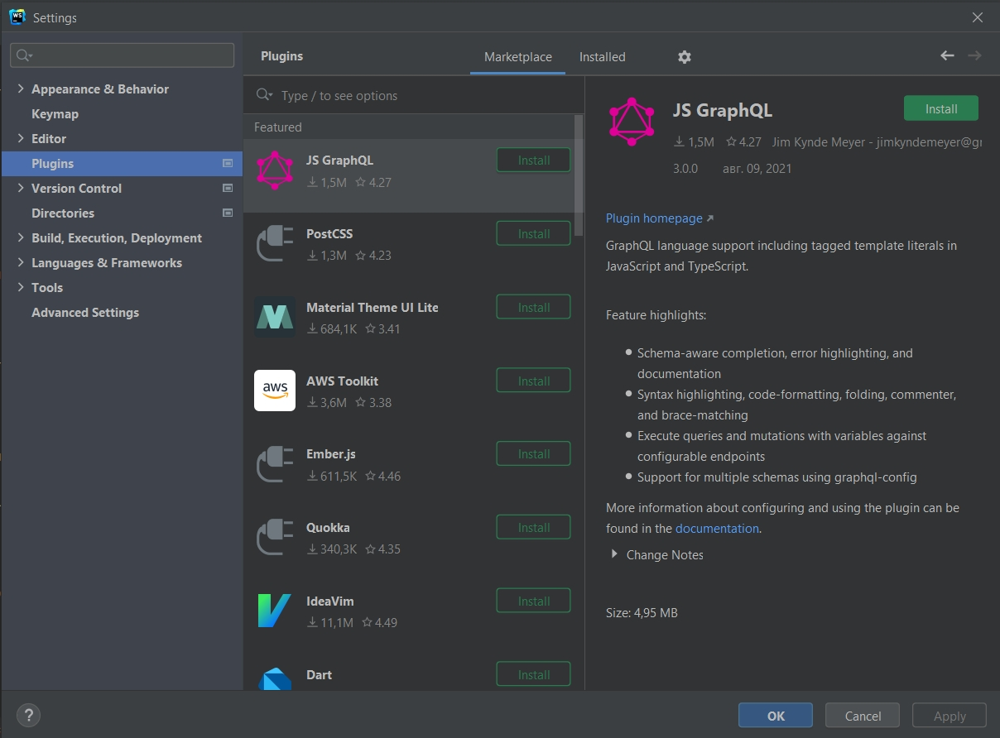

У нас есть установленные плагины которыми мы расширяем функционал редактора.

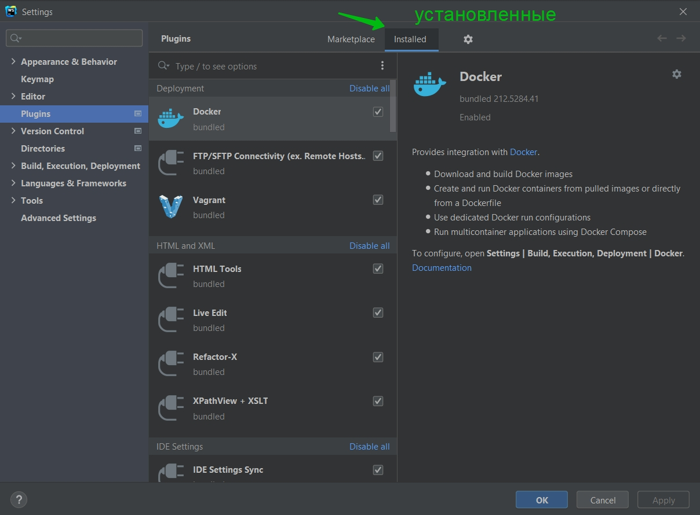

Либо у нас есть готовый Marketplace.

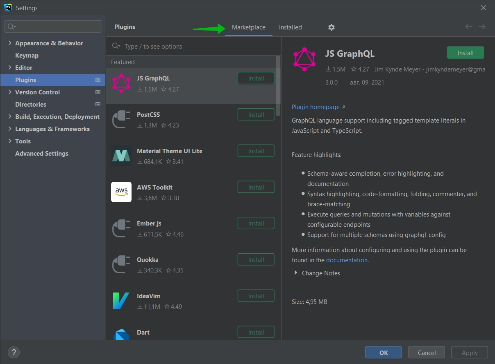

 
 
 

Еще одно очень важное поле которым я часто пользуюсь это Languages $ Frameworks и конкретно это JavaScript.

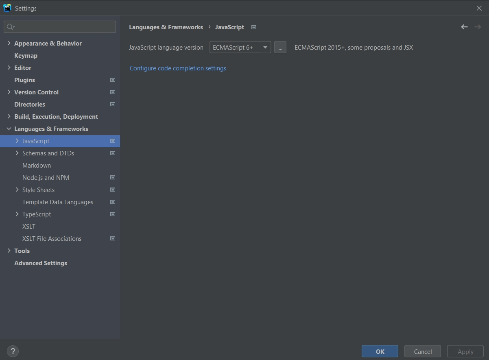

Во-первых здесь мы выбираем актуальную версию на которой мы пишем.

И так же есть очень важный пункт это Node.js and NPM.

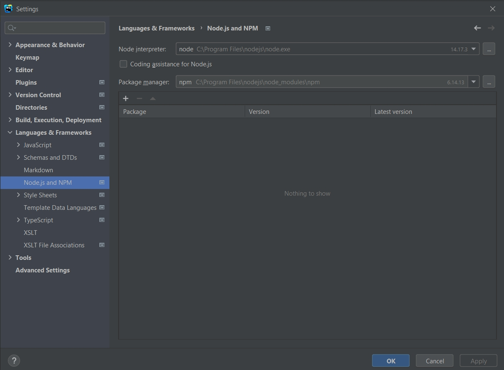

По умолчанию WebStorm не потдерживает Node. Для того что бы она работала нам нужно поставить галочку Codding assistance for Node.js.

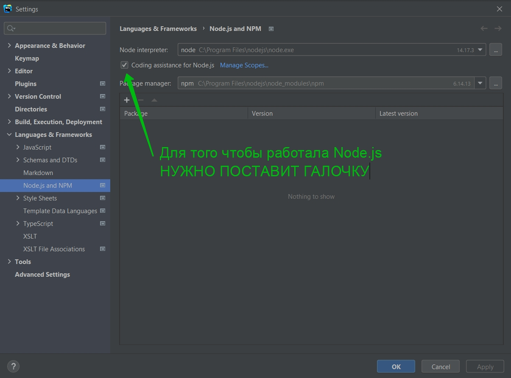

Тогда он подключает целую библиотеку встроенных модулей в Node.js.

Это что касалось базовых настроек. Их довольно много.
