# Интерфейс

Теперь поговорим про внешний вид. В toolbar есть поле View в котором мы можем играть с внешним видом.

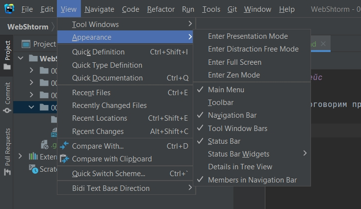

Помимо этого в WebStorm присутствуют такие крутые вкладки как Project с которой мы впринципе познакомились. Здесь хранится весь набор папок и файлов для нашего проекта.

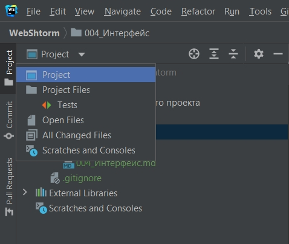

Здесь мы можем смотрет различную структуру Project Files. Если мы это выберем то папка node_modules пропадет.
Мы можем посмотреть только открытые файлы на текущий момент Open Files.
Либо посмотреть на весь проект Project. Т.е. тут присутствуют различные фильтрации.

Помимо этого мы можем все разворачивать и все сворачивать.

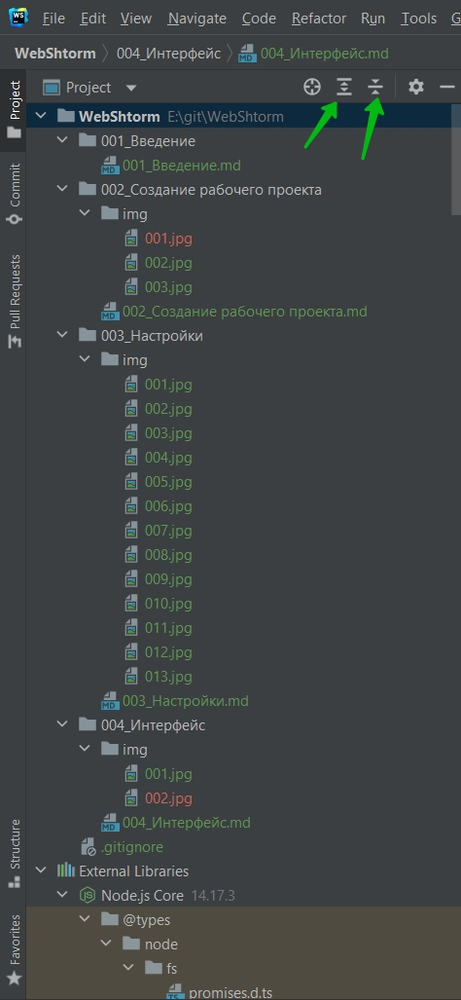

Находить текущий выбранный файл.

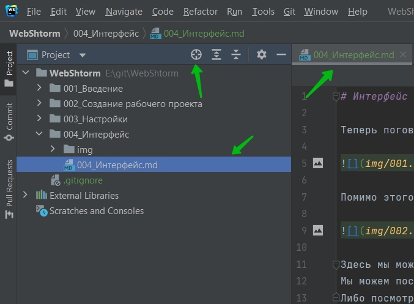

Следующее поле Structure. Оно у меня не открыто. Для того что бы открывать различные вкладки левой панели необходимо зажать Alt + порядковый номер вкладки. Structure номер 7.

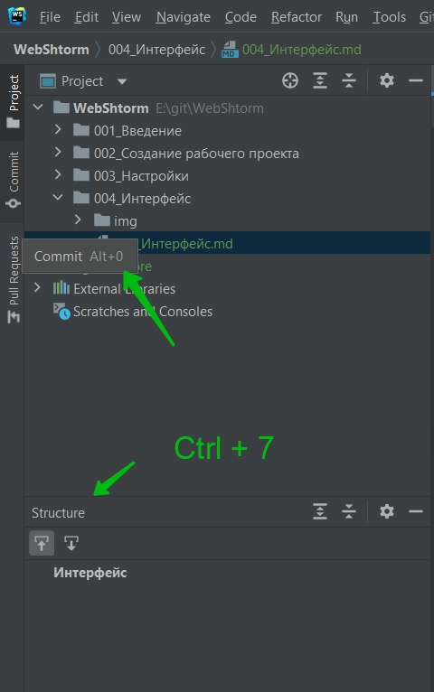

Structure это очень крутое меню показывающее что вообще находится в нашем файле.

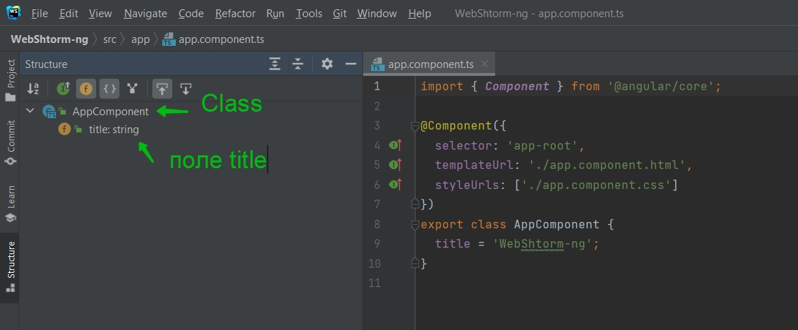

Мы видим что у нас есть класс AppComponent у которого есть поле title.

Если я напишу какой нибудь метод, то он так же появится. В этой вкладке мы можем быстро смотреть а что вообще происходит в нашем файле. Какие методы есть и как ими пользоваться.

 
 
 

Так же у нас присутствует вкладка npm которая позволяет вызывать различные npm скрипты.

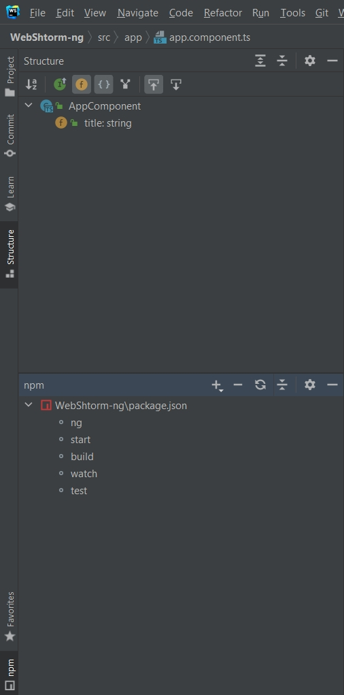

Например по клику на команду start я могу запустить проект.

 
 
 

Встроенный терминал

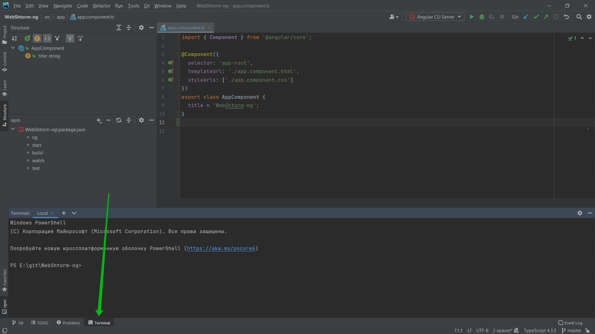

 
 
 

Помимо этого в WebStorm есть очень класное контекстное меню которая позволяет выполнять различные команды.

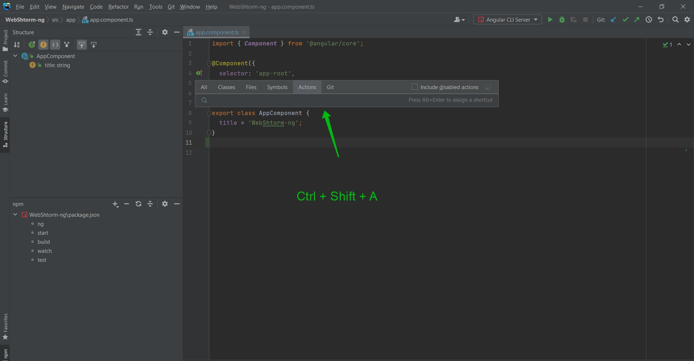

Я могу вписывать название каких-то команд и WebStorm их выполнит. Например я хочу убрать номера линий.

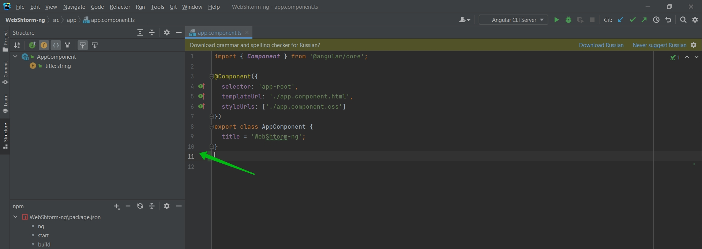

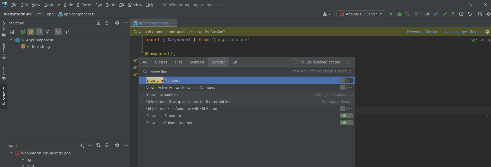

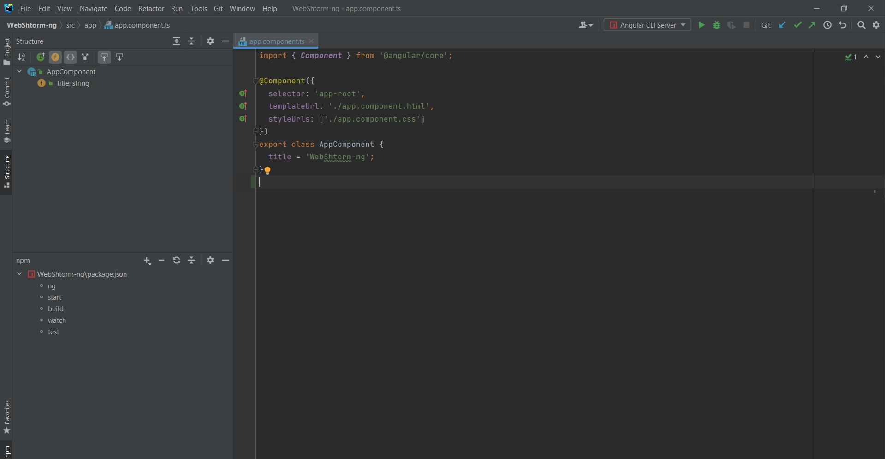

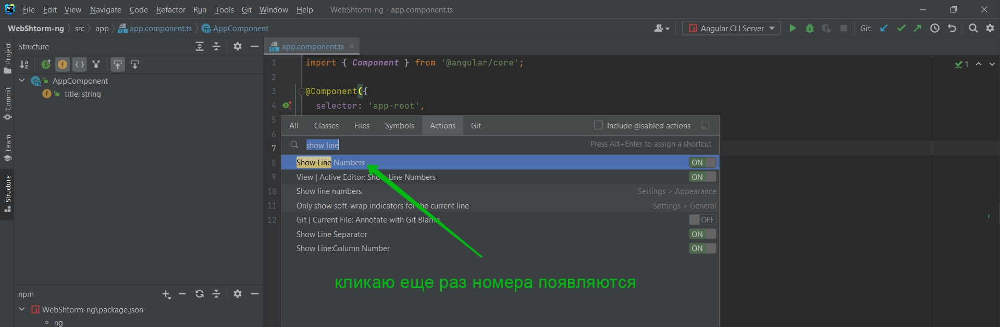

Так же это можно сделать если нажать правой кнопкой мыши

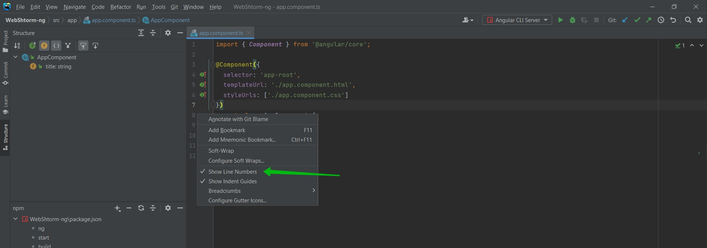

Так же в WebStorm есть класный ZenMode. Если я наберу.

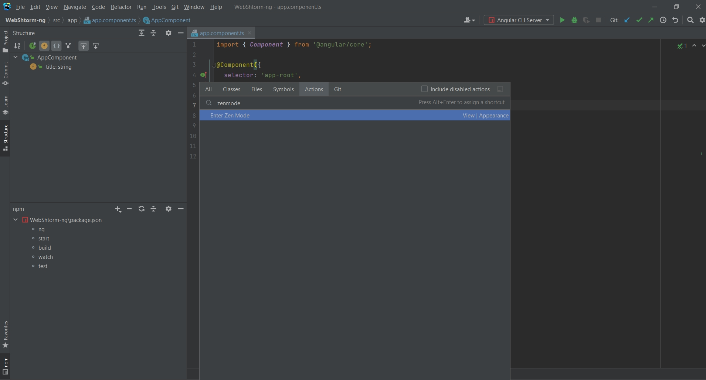

То я попадаю в полноекранный режим где нет вообще ни каких отвлекающих элементов.
Что бы выйти из полноэкранного режима так же Ctrl + Shift + A где набираю zenmode.

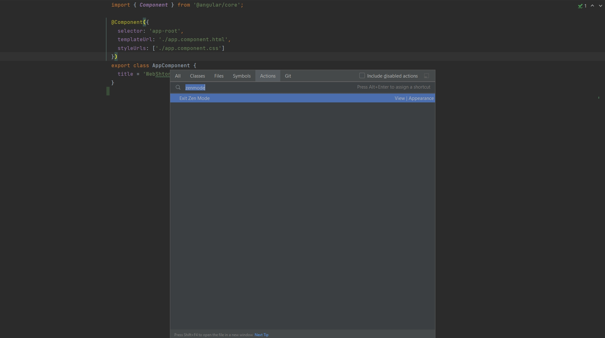
