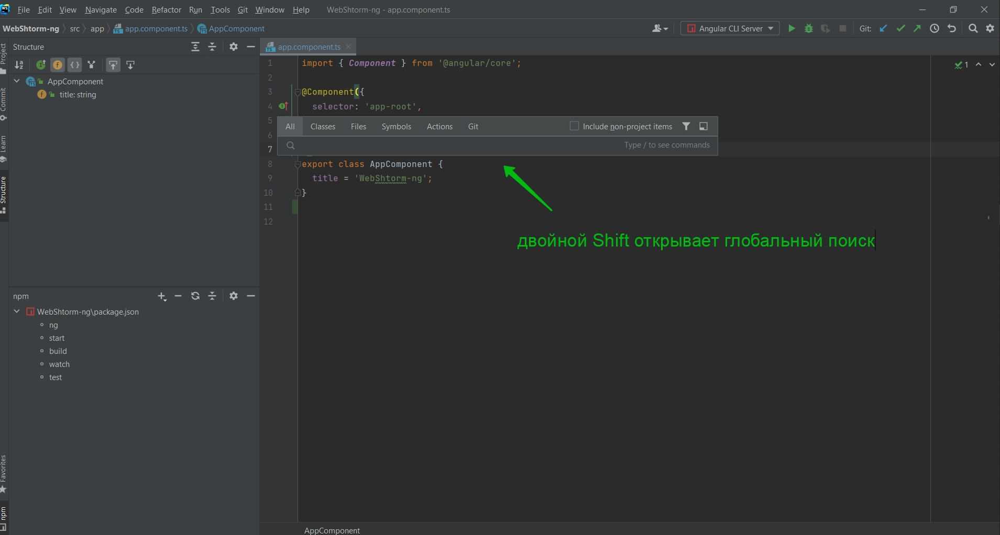
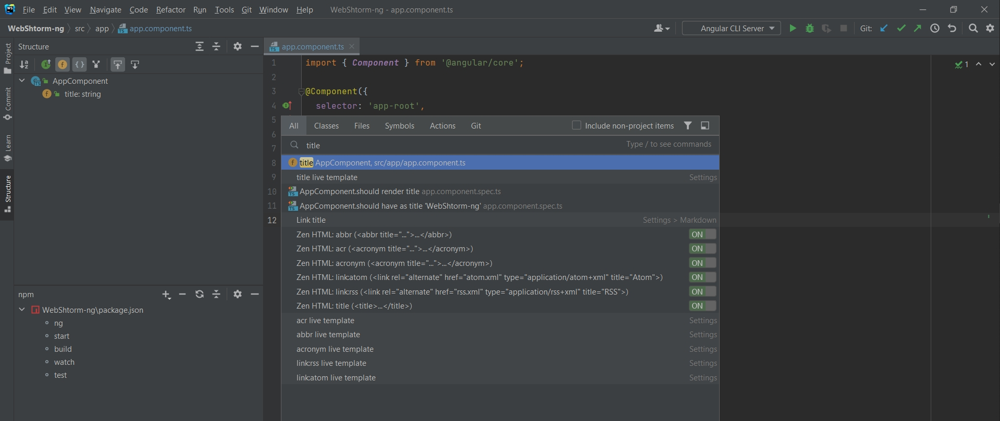
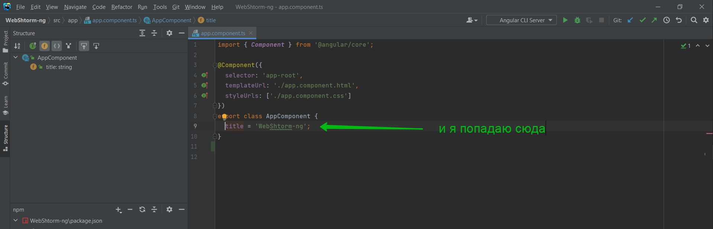
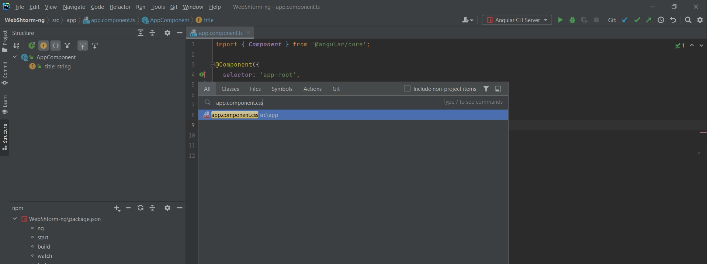
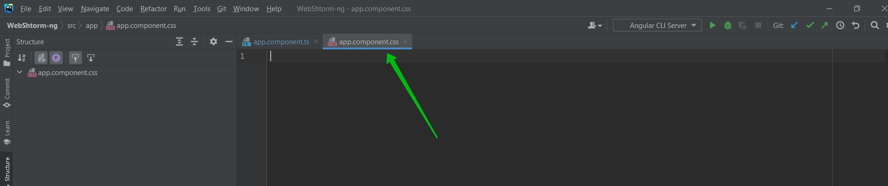
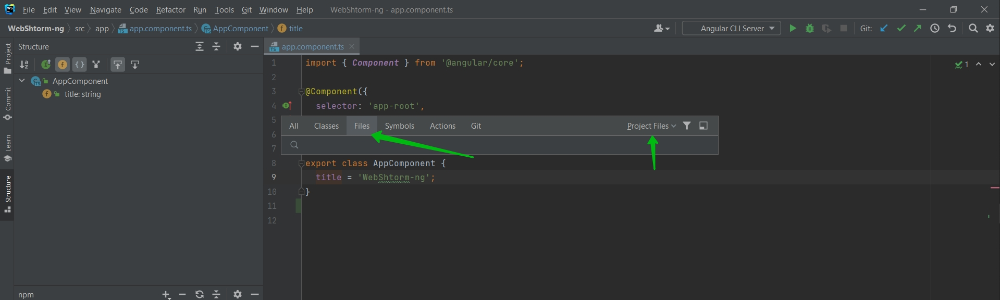
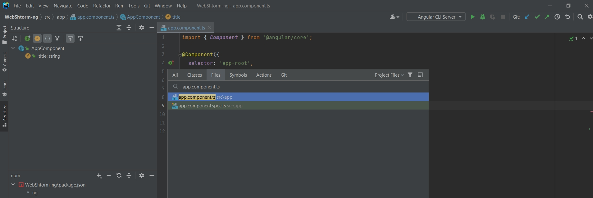
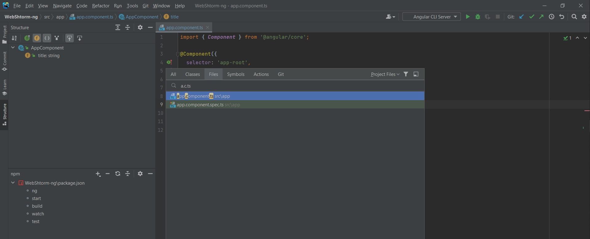

# Горячие клавиши

Мы уже рассмотрели Alt + Shift + A - это действия внутри редактора.

Так же присутствует очень мощная клавиша двойной Shift. Если я ее нажимаю, то я попадаю в глобальный поиск.

WebStorm будет искать вообще по всему что есть в проекте. 

Например здесь я захочу перейти в какой-нибудь файл где присутствует поле title.

Либо я хочу попасть в какой-нибудь конкретный файл.

 
 
 

Для того что бы WebStorm делал поиск по файлам существует другая горячая клавиша Ctrl + Shift + N.

Таким образом мы сразу попадаем в Files.

Вы могли обатить что не так удобно писать целиком название файла. И WebStorm позволяет делать это проще.
Например я могу писать таким образом.

