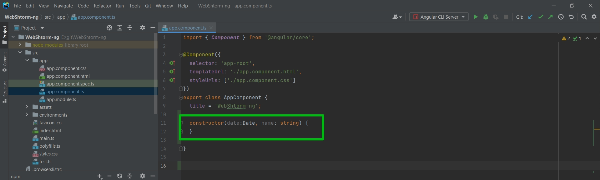

# Контекстное меню

Скажем в классе я хочу создать конструктор который будет принимать определенные параметры.

Для того что бы корректно инициализировать параметры в конструкторе нам необходимо написать this.Date = date и т.д.
Но мы видим что появляется вот така желтая лампочки. Это называется контекстное меню. Его я могу вызывать с помощью Alt + Enter.
И тут есть помошник который помогает нам что-то сделать за нас. Напримет инициализировать новые поля из параметров.

И мы можем выбрать или одно поле. Или инициализировать все поля.

Можем выбрать тип private, protected, public.

Представте если у вас много параметров. Таким образом вы сможете быстрее все это дело автоматизировать.

Если мы перейдем в структуру Alt + 7, то сразу же увидим структуру.

Другой мощной штукой которая есть в WebStorm это поиск использований конкретно этих элементов или полей.

Рассмотрим на примере title. Я хочу понять где вообще этот title используется. Для этого я могу кликнуть на title и нажать Alt + F7.

Мы попадаем в такой пункт в котором показывается где данная переменная используется. Мы видим где это поле вообще задействовано.
Мы видим что оно конкретно используется в app.component.html на 344 строчке.

Что круто, мы можем автоматически рефакторить какие-то переменные и не делать это вручную, а делать это с помощью самого WebStorm.

Например я двойным нажатием выделю  title и нажму Shift + F6.

Это действительно ускоряет разработку.

