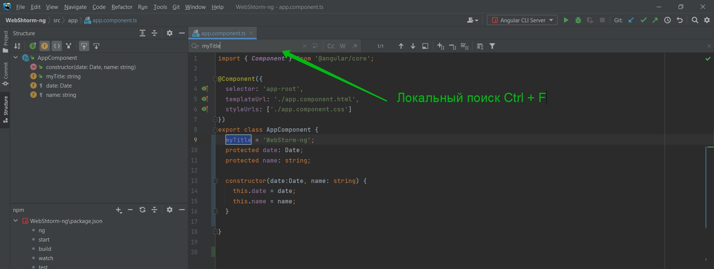
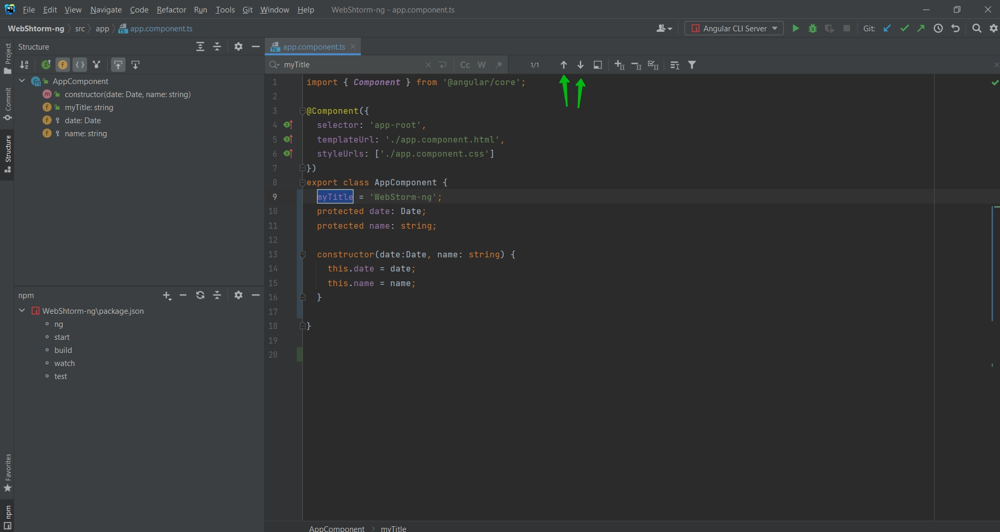
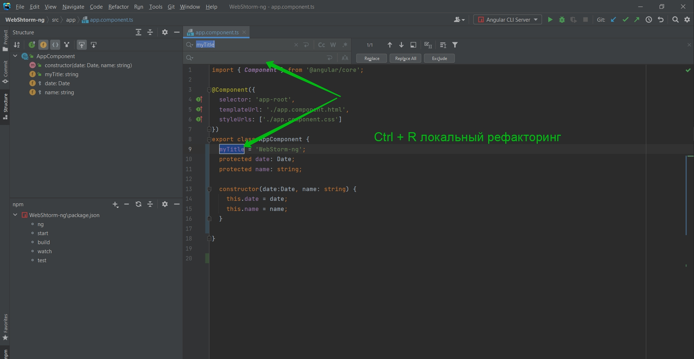
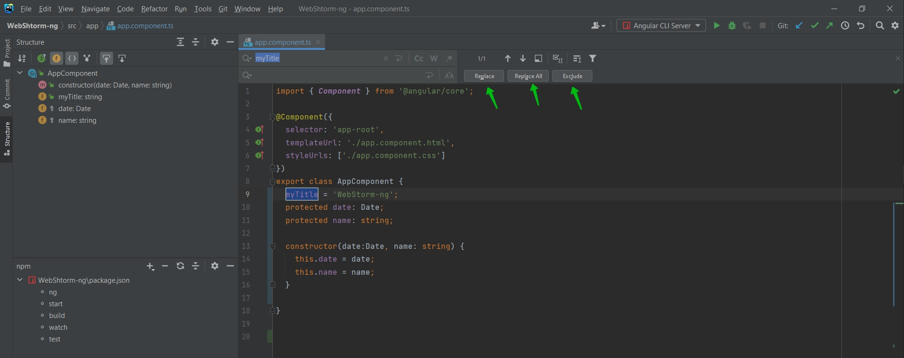

# Поиск

Поговорим более подробно про поиск.

Для глобального поиска мы можем использовать двойной Shift. Мы можем искать все All. Мы можем искать определенные классы Classes. Мы можем искать по Files. и т.д.

Либо например мы можем использовать локальный поиск Ctrl + F.

Мы можем перемещаться с помощью элементов Control от одной обнаруженной области к другой.

Если мы допустим хотим сделать локальный рефакторинг, то мы можем нажать Ctrl + R. Таким образом мы будем говорить WebStorm что на что мы хотим поменять.

Здесь мы можем заменить все или заменить конкретне совпадание.

