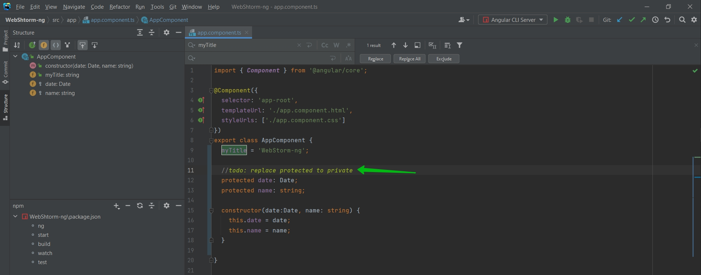
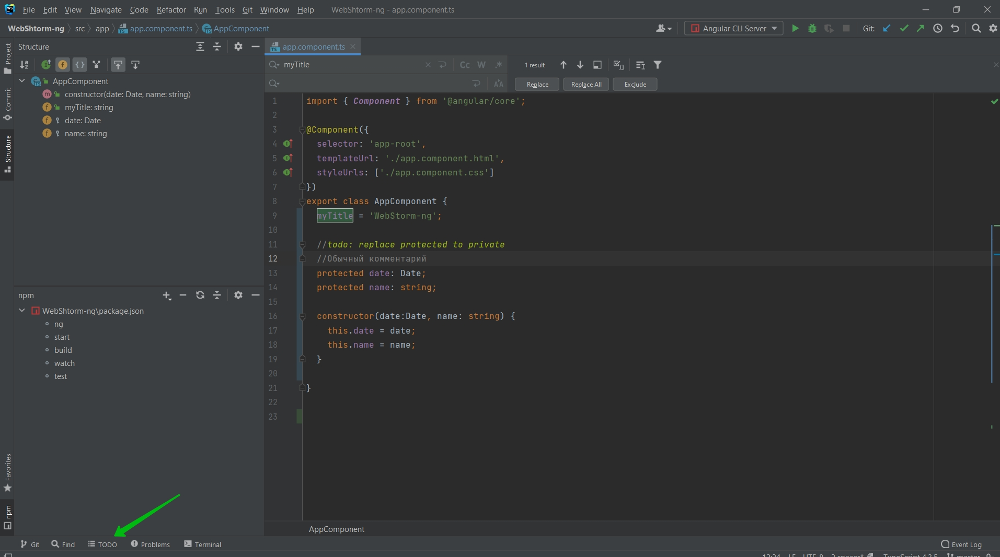
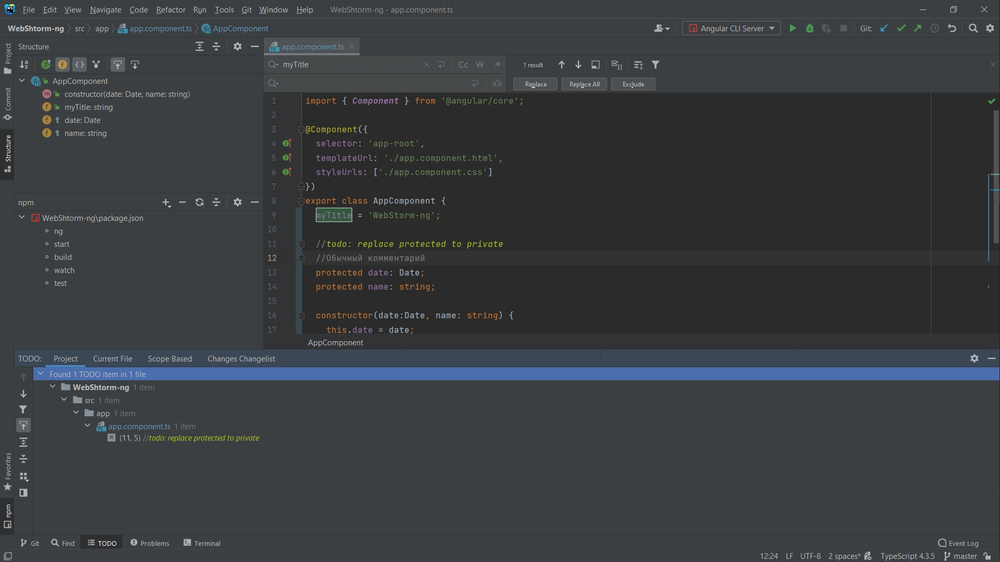
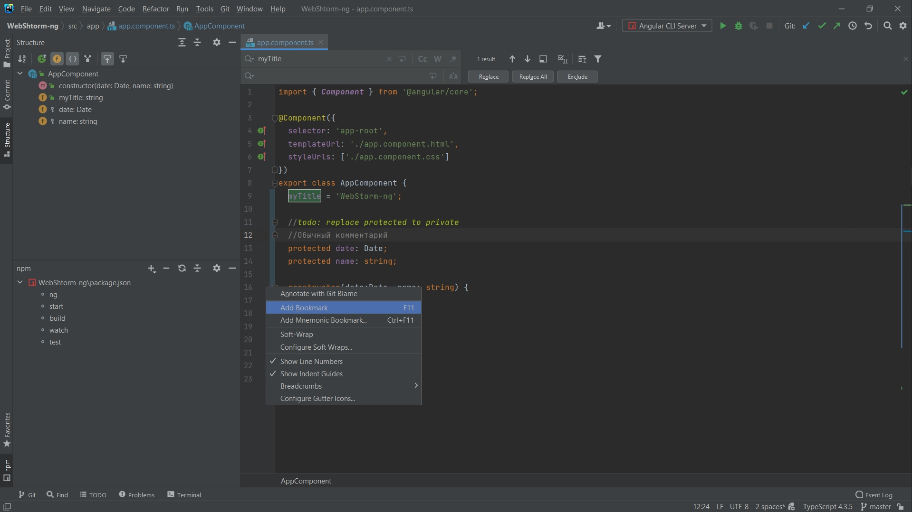
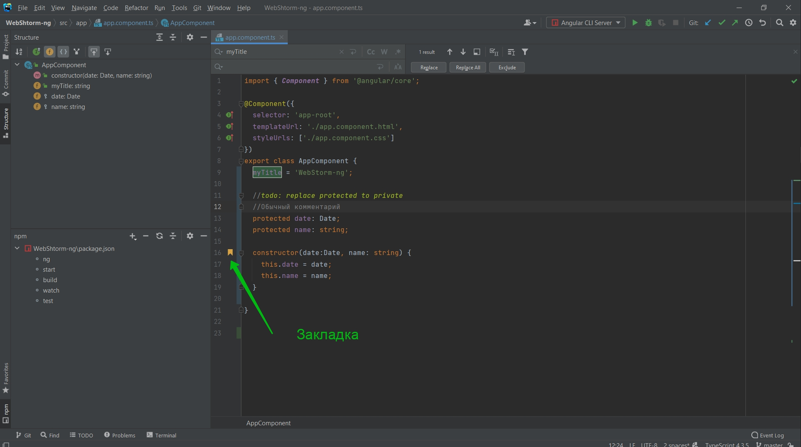
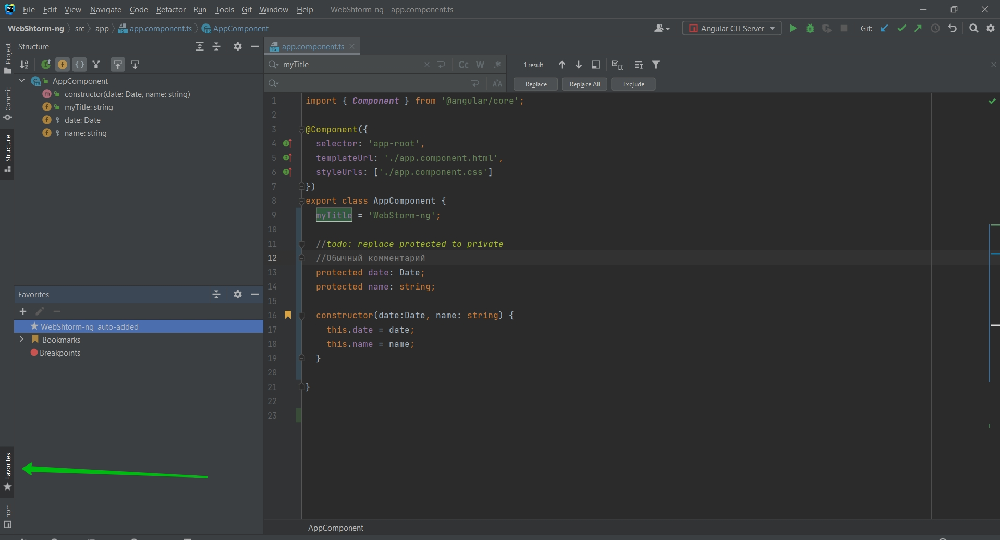
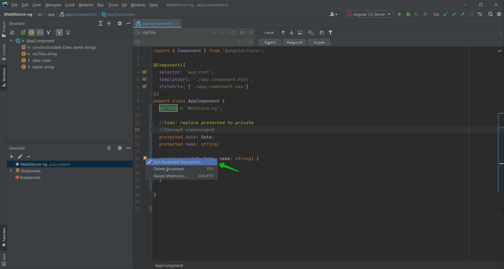
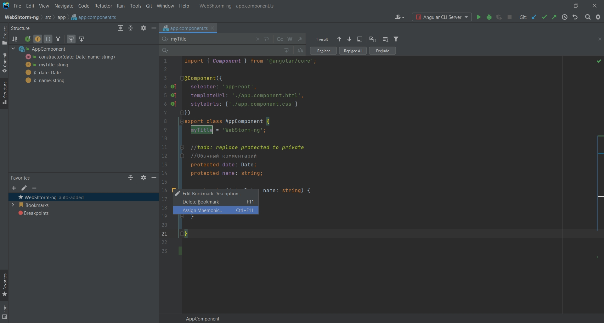
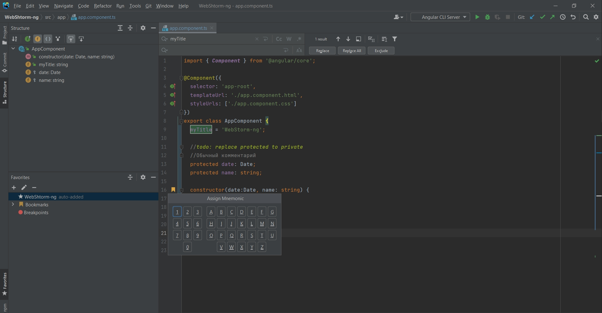
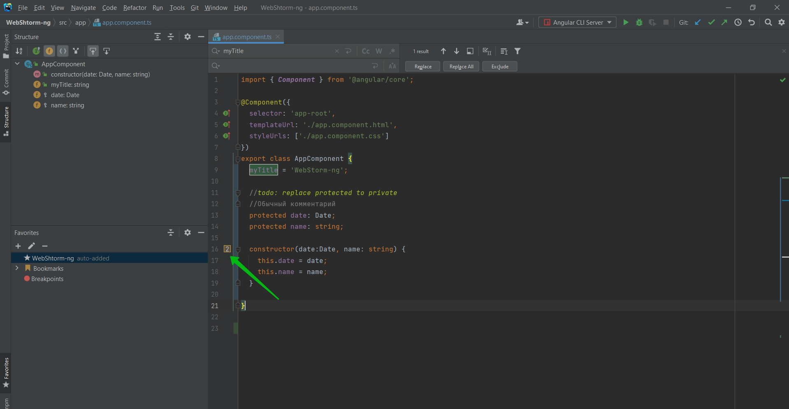

# Закладки/To-do

Мы можем оставлять закладки и создавать To-do.

Например To-do выглядит как обычный комментарий. Я ставлю комментарий и ключевое слово todo:

Допустим я хочу оставить заметку для будущей разработки что мне необходимо поменять protected на private. 

Теперь todo подсвечивается другим цветом чем обычный комментарий

И у нас есть целая вкладка TODO которая ищет все todo в нашем приложении.

Так же у нас есть закладки которые позволяют нам вернуться к часто используемым местам. Перехожу к интересующему меня методу или функции. Слева нажимаю правой кнопкой мыши и выбираю Add Bookmark.

Теперь закладки появляются в поле Favorites

Которую мы можем вызвать Alt + 2.

Более того мы так же можем их настраивать.

