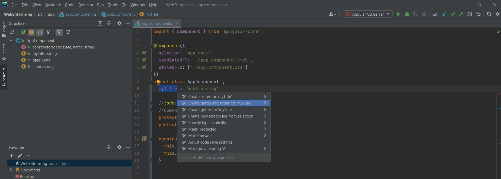
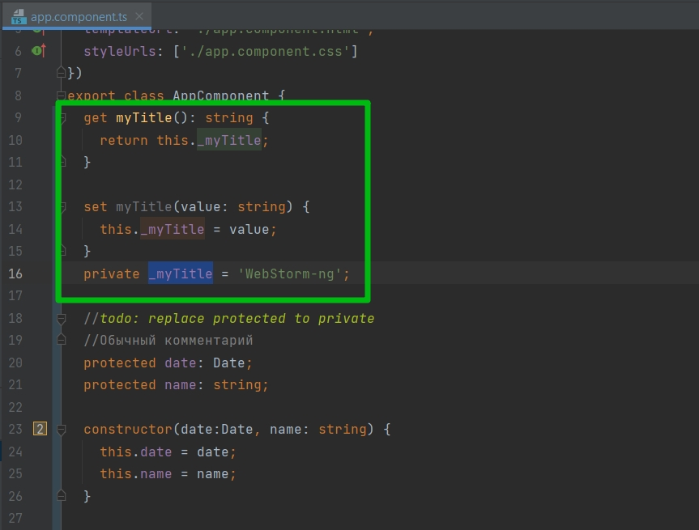
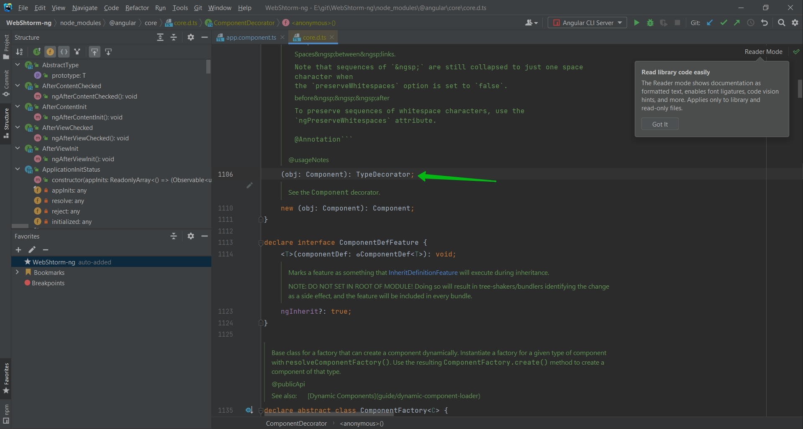
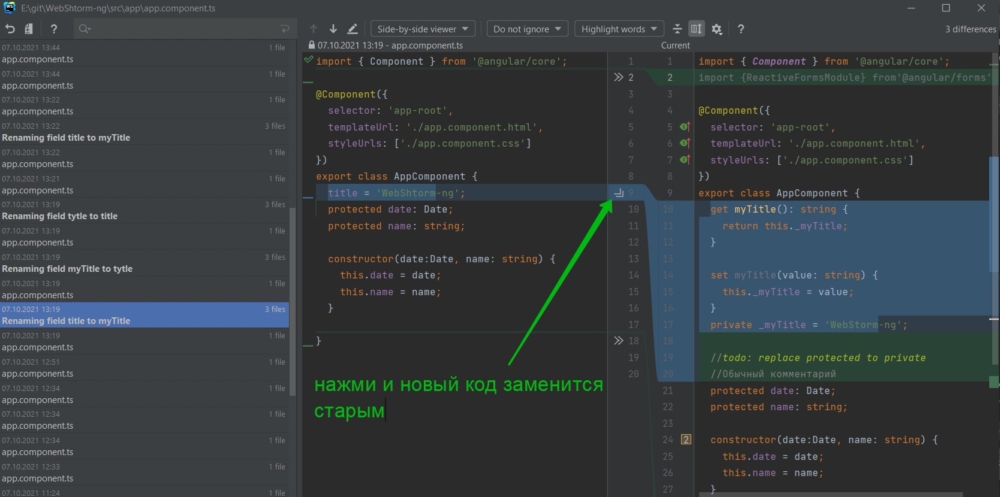

# Работа редактора

Для этого я создам метод demo. и давайте посмотрим что из себя представляет autocomplete.

Вот он точно понимает что это глобальный объект document и через точку он выдает все его методы.

Более того мы можем получать документацию сразу же внутри редактора. Документация она интегрирована с MDN.

Отсюда мы можем сразу же перейти на сайт документации. Либо же я хочу посмотреть документацию по методу addEventListener. Так же вызвать докуметацию можно просто навестись мышью на интересующий метод и немного подождать.

 
 
 

Помимо этого мы можем с помощью горячих клавишь добавлять например различные геттеры и сеттеры. 
Выделяем интересующий нас объект. С помощью Alt + Enter вызываю контекстное меню. И в нем выбрать что бы он сделал и геттеры и сеттеры.

 
 
 

Одна из моих любимых фишек на большом проекте это оптимизация импортов.
Не используемые импорты мы можем удалять вручную или воспользоваться 

 
 
 

Еще одна очень мощная возможность это то что мы можем переходить к определению какой-либо сущности. Скажем я хочу понять а что вообще такое @Component.
Я могу нажать Ctrl + клик.

И я перехожу к самой библиотеке.

 
 
 

Помимо того я могу в файле в котором работаю нажать правой кнопкой и выбрать local History.

Мы можем увидить все те изменения которые мы вносили сегодня в файл.

Мы можем смотреть какие произошли изменения. Это кстати очень сильно помогает когда произошла ошибка и вы хотите понять что пошло не так. Именно этот функционал помагает дебажить проекты.

И если я понимаю что мне нужно вернуть какой-то кусок кода я могу просто нажать стрелочку.

 
 
 

Теперь поговорим про Warnings.

Бывают ситуации когда webStorm ругается, но в принципе данную конструкцию использовать можно. Для того что бы это настроить перехожу в настройки в поле inspections. Далее выбираю интересующий язык.

