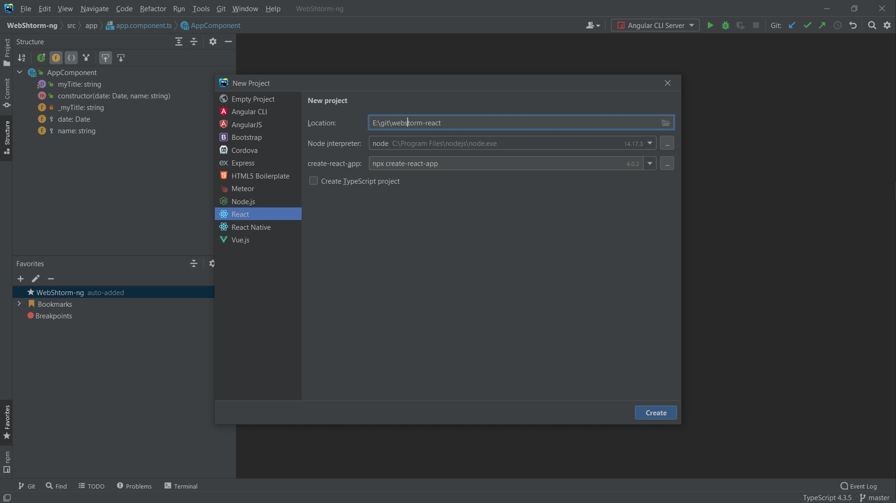
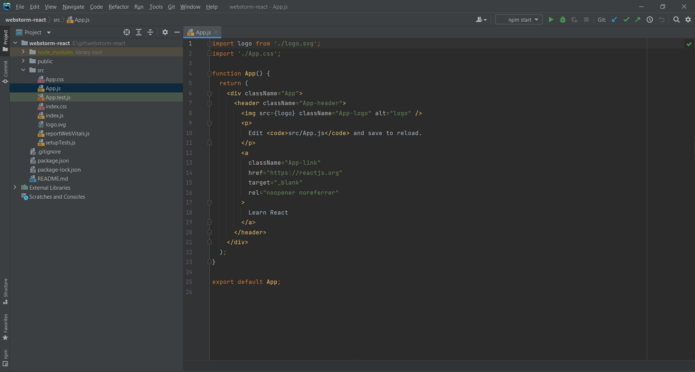
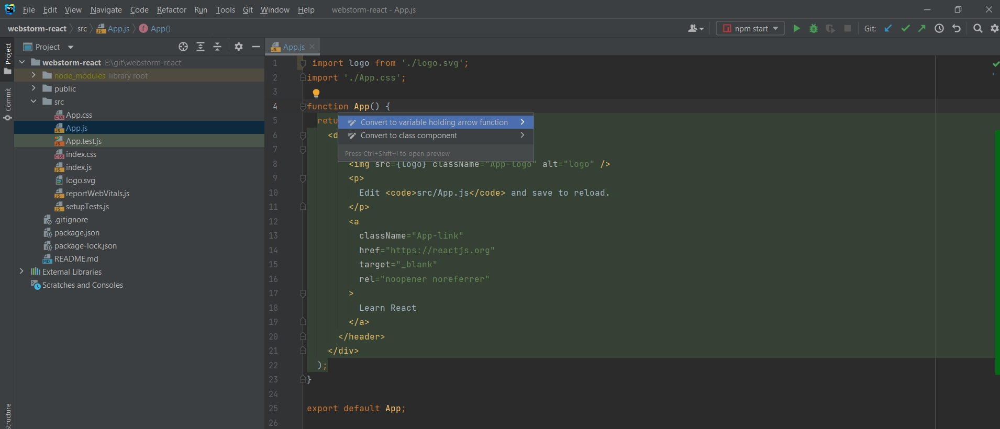
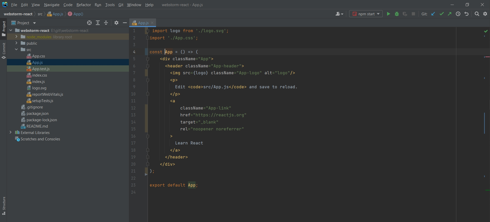
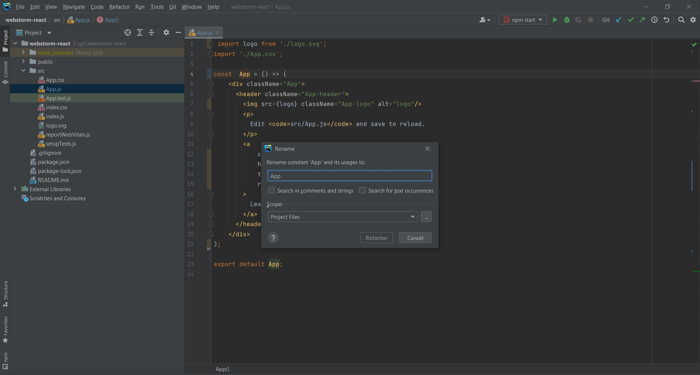
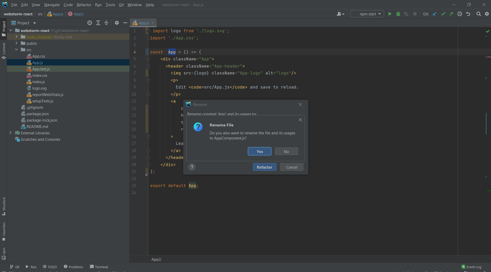
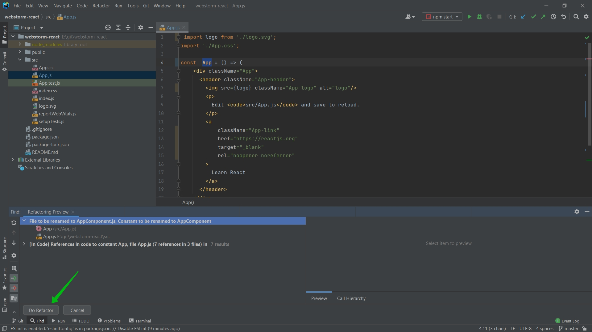
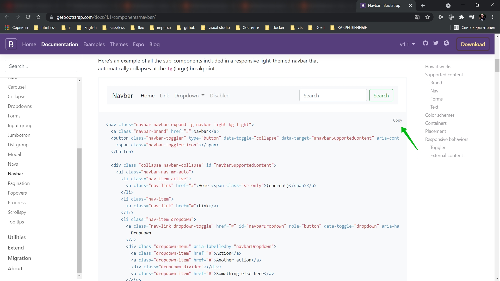
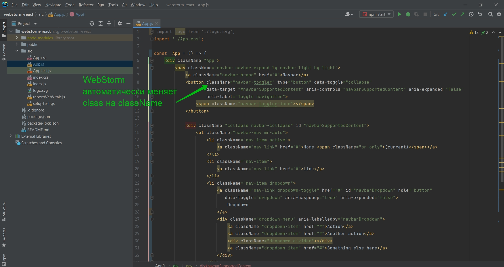

# Работа с React

Создаю новый проект.

Например после создания прокта у меня есть вот такой компонент.

Я могу вызвать контекстное меню. Он нам предлагает сконвертировать данный компонент в стрелочную функцию.

Таким же образом я могу привести к классовоу компоненту.

Если везде хочу переименовать компонент то Shift + F6.

При переименовании WebStorm автоматически предлагает переименовать и файл.

Разумеется в WebStorm очень хорошо работает система автоматических импортов. На ней я останавливаться не буду.

И есть еще одна фишка.

Я к примеру перехожу к bootstrap. И на сайте копирую логику компонента навигации.

Обратите внимание когда мы копируем какой-то шаблон, тогоже bootstrap. 

Я могу исправить на Warning или скажем на Weak warning.

В React существует проблема. В шаблоне используется class а в React className.

