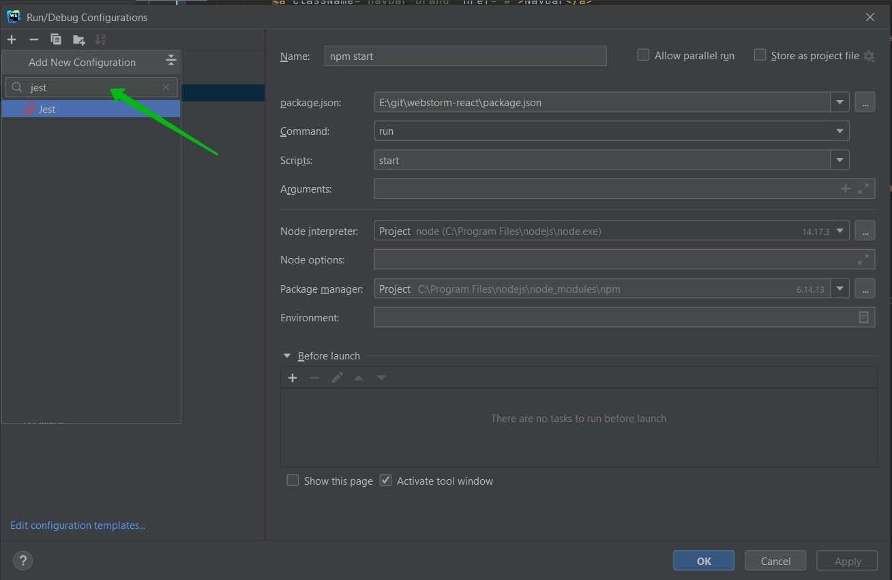
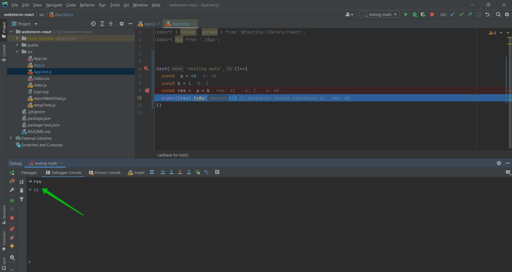

# Тестирование и Дебаг

WebStorm позволяет внутри себя запускать тесты. 

Но для начало это необходимо все настроить. В верхнем меню которое называется Run выбираю edit configurations


Для того что бы добавить среду для запуска unit test. Конкретно реакт работает с Jest.





И теперь для того что бы запустить test мы можем нажать правой кнопкой


Ради примера добавлю test.

```js
//App.test.js
import { render, screen } from '@testing-library/react';
import App from './App';

test('renders learn react link', () => {
  render(<App />);
  const linkElement = screen.getByText(/learn react/i);
  expect(linkElement).toBeInTheDocument();
});

test('testing math',()=>{
  const  a = 40
  const b = 1
  const res =  a + b
  expect(res).toBe(42) // результат должен равняться 42
})
```


Мы ожидаем 42  а получаем 41. Мы можем поставить break point  и конкретно подебажить этот test.


До того как компилятор доходит до break point мы можем посмотреть что вообще происходит с нашим кодом.

Так же мы можем наблюдать весь CallStack который здесь происходит.


У нас есть определенные контролы которые позволяют нам путешествовать по выполнению данного кода.


Теперь мы можем посмотреть что у нас случилось с res.


Но нам то нужно 42. 

Таким образом WebStorm нам интерактивно позволяет смотреть в редакторе что не так у нас с тестами и исправлять это.
Более того у нас присутствует вкладка Debugger Console


где мы можем смотреть в интерактивном формате что у нас происходит с кодом. Например что у нас сейчас находится в переменной res.




<br/>
<br/>
<br/>

Аналогичным образом мы можем дебажить не только тесты но и рабочий код.

Создам файл node.js который как раз будет работать на платформе Node.js.

```js
//node.js
function sum (a, b){
    return a + b
}

const res = sum(40,2)

console.log(res); // res.log + Tab что бы автоматизировать процесс
```

Теперь 


Если это необходимо продебажить.


И так же я могу смотреть какие есть локальные или глобальные объекты. Например я могу так же перейти в саму функцию и посмотреть чему равняются эти параметры.


Это так же работате и для обычных Node.js программ.