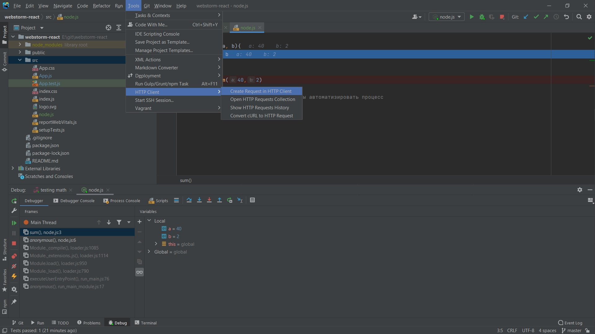
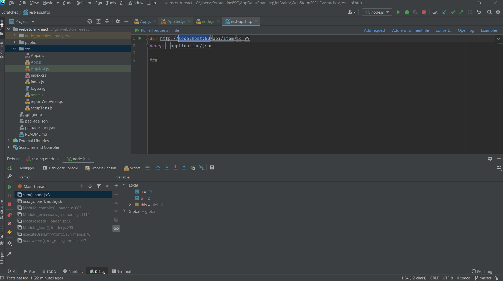
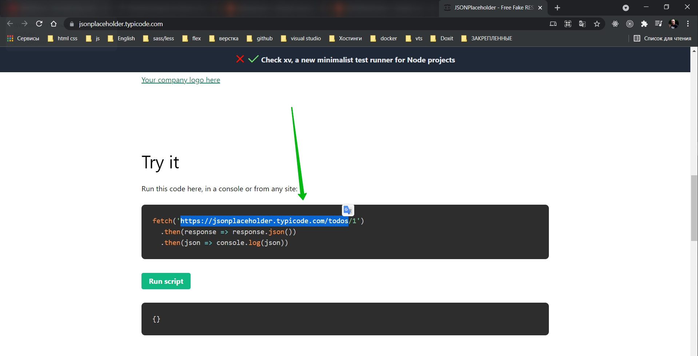
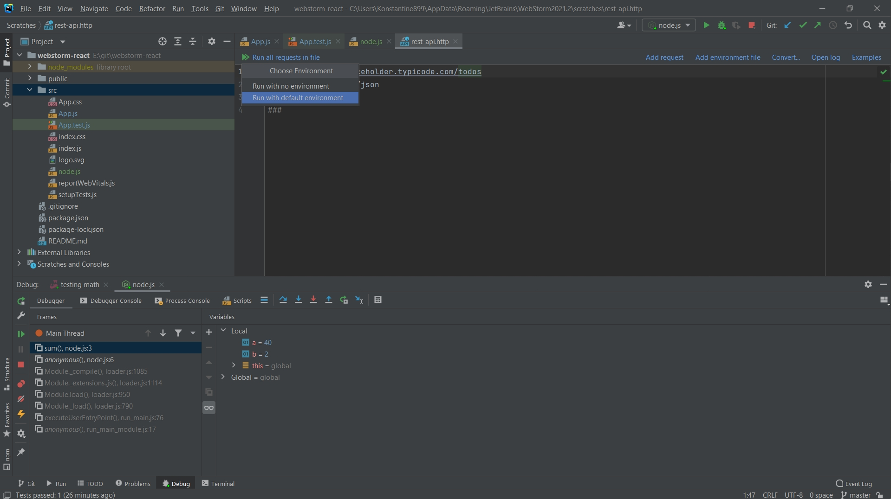
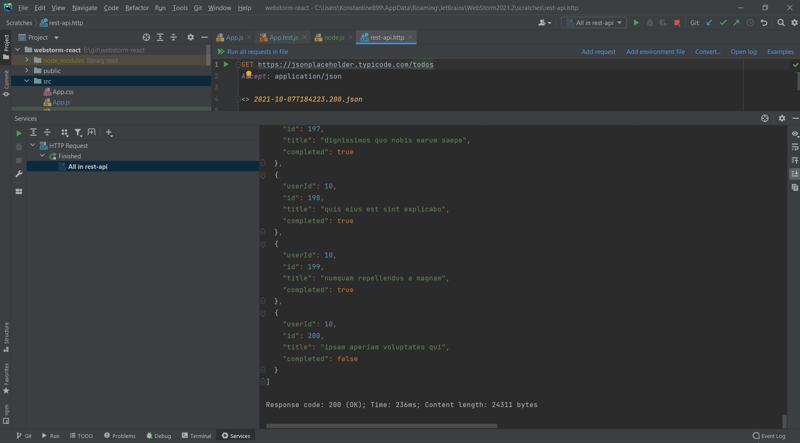
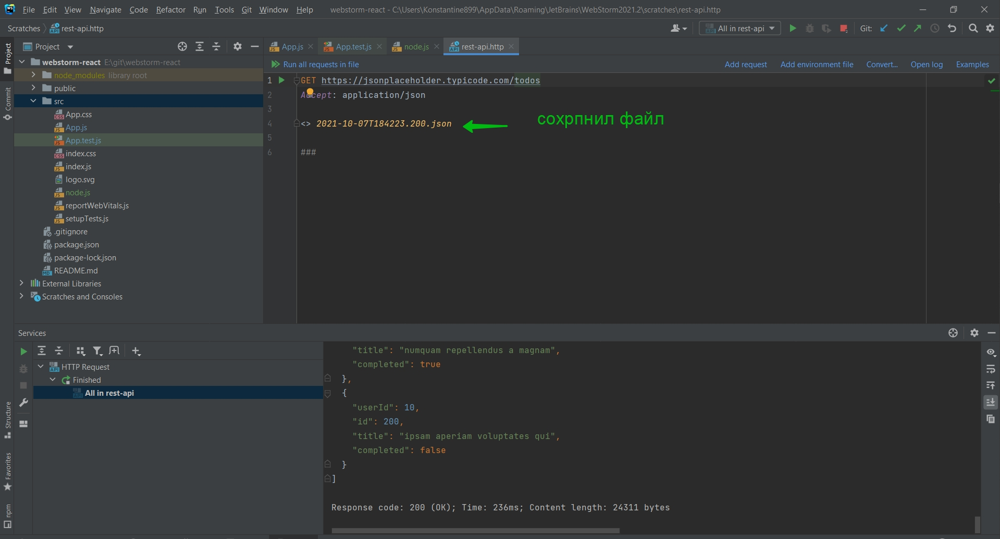
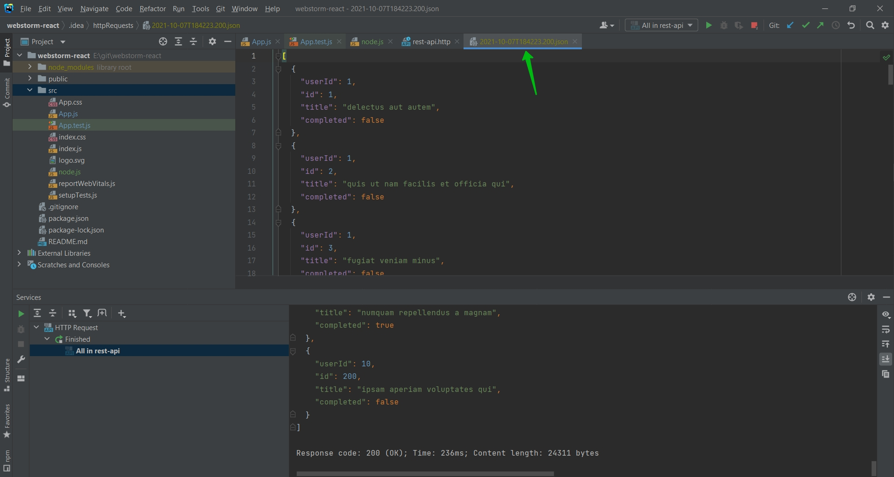
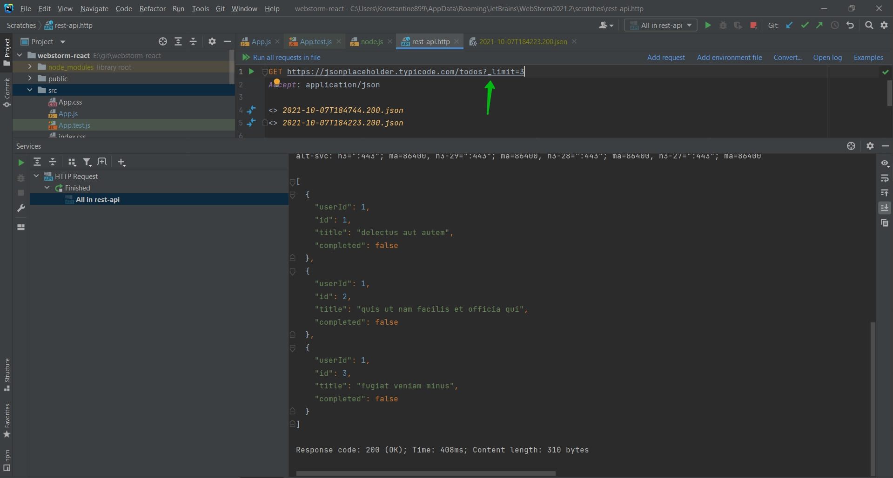

# Встроенный HTTP Клиент

Для этого вверху есть поле Tools. И если я перейду в раздел HTTP client.

Здесь все работает довольно просто. Мы можем выбрать либо GET либо POST запрос. 

Рассмотрим на примере [JSONPlaceholder](https://jsonplaceholder.typicode.com/)

Теперь что он сделал.

Во-первых он нам локально сохранил данный файл.

Перехожу в данный файл с помощью Ctrl + клик.

Я так же могу добавить query параметр ? который ограничит количество выдаваемых элементов.

Таким образом мы тыстируем API даже не выходя из редактора.

Данные файлы лежат в системной папке .idea в ней вообще лежат все настройки которые мы делаем для данного проекта.