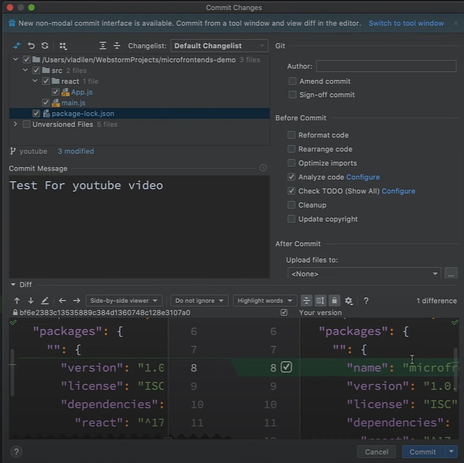

# Git

Так как я вошел в Git на компьютере то я могу сразу же сделать поиск по моим репозиториям.

так как мы работаем с package.json и у нас должны быть установлены зависимости. В правом нижнем углу экрана WebStorm
предлагает установить все библиотеки.

подсеченная синяя строчка говорит о том что я делал изменения со времен последнего коммита.

Мы можем посмотреть кто правил эти строчки.

Когда я хочу сделать коммит мне в первую очередь нужно определиться в какой ветке мы находимся

И мы например хотим сделать pull request. Я могу сделать отдельную ветку.

Если стоит галочка Checkout branch то мы после создания сразу можем перейти на эту ветку.

Если я хочу сделать коммия я в верху могу перети в поле Git

И мы можем посмотреть что было изменено в данном проекте.

У него и у меня отличается

Я могу как отдельно закомитить и так же можно закомитить и сразу запушить.

Внизу в левом углу есть вкладка Git которая очень силь подсказывает вообще что нам делать.

И для того чтобы запушить нажимаю CTRL + SHIFT + K.

