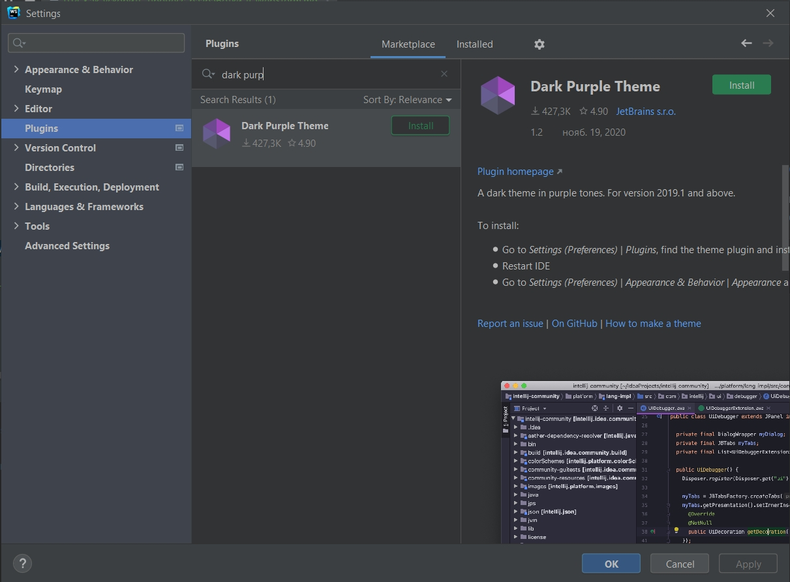
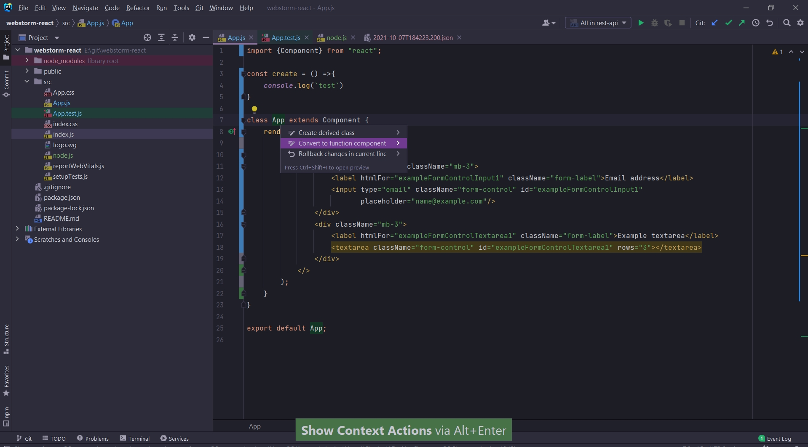

# Как ускорить процесс разработки в WebStorm

[https://www.youtube.com/watch?v=G3O7gJR5eYE](https://www.youtube.com/watch?v=G3O7gJR5eYE)

Есть много разных способов запустить WebStorm. Самый рекомендуемый способ это использовать [JetBrains Toolbox](https://www.jetbrains.com/toolbox-app/)

Этот инструмент позволяет кроме того как установить WebStorm, он так же позволяет его обновлять. И так же можно откатиться на предыдущую версию.
Кроме того если вам нужно пользоваться несколькими IDE то они тоже тут будут.

Мы можем установить тему Dark Purple

Для того что бы быстрее себя приучить к сочетаниям клавишь можно зати в help
и выбрать Keymap reference.

Это pdf файл который можно распечатать.

Рефакторинг кода.

Сtrl + Ctrl + A

 
 
 

Базовая навигация (по проекту, по файлу)

Или просто Ctrl + Alt + L.

Resent files показывает последние файлы с которыми вы работали.

История перемещения коретки

Перейдет к другой позиции даже если эта позиция была в другом файле. Т.е. таким образом мы можем пройтись по всем тем местав в которых были.

 
 
 

Про индексацию файлов

Это одна из самых важных фитч которая есть в IDE. Но так же индексация требует некоторого количества времени и очень часто растраивает пользователей.

Индексация нужна для того что бы вообще понять что есть в вашем проекте. Концепт ее такой.
Мы берем все файлы которые существуют в проекте проходимся по ним. Строим для них синтаксическое дерево. Анализируем эти синтаксические деревья. Вытаскиваем из них нужную нам информацию и сохраняем куда-то в индекс. 
А потом кода возникает потребность в каком-то умном поиске мы можем воспользоваться этой информацией и сделать так что бы перейти к нужному файлу максимально быстро.

Кроме файлов сть классы.

и последняя самая важная вещь это Symbols. Это все сущности которые имеют какое-то имя в вашем проекте. Мы можем найти какие-то css классы. Мы можем найти какую-то функцию.
Так же он позволяет делать поиски по всяким маскам.

 
 
 

Редактирование кода.

Одна из самых важных вещей это Alt + Enter

Здесь мы можем конвертировать файлы так как нам надо. Классы в arrow function  и обратно. И не только.

Так же этим круто пользоватся во время написания кода.

Запуск прямо из IDE

 
 
 

Рефакторинг кода

Для useState мы предлагаем переименовать сразу две переменные. Скрин делать не буду.

Следующая вещь которую я хочу сделать это создать новый компонент. Кримеру я выделяю интересующий кусок кода.
Ctrl + Shift + A  выбираю Refactor this  и дальше выбираю Action acstract component

Так же можно для каких либо фишек добавления в код исаользоват Alt + Enter.

Так же мы можем кусок кода перенести в другой файл.

Есть другие способы рефакторинга. К примеру я написаю слушатель события onClick. Но еще не создал функцию которая данный клик обрабатывать. Я пишу название функции и Ctrl + Alt + V.

Для классов тоже есть много способов рефакторинга. Способов на самом деле не вероятное количество.

Для того что бы вывести в консоль интересующую нас переменную можно написать название переменной, поставить точку и log

Найди все что есть по Emmet. Реально повысит скорость разработки. Все что связано с HTML подобными языками реально помогает.

 
 
 

Git

Для коммита очень удобно вызывать Ctrl + K

Здесь можно понять что мы хотим коммитить. Что не хотим коммитить

Ctrl + Shift + K можно запушить изменения.

